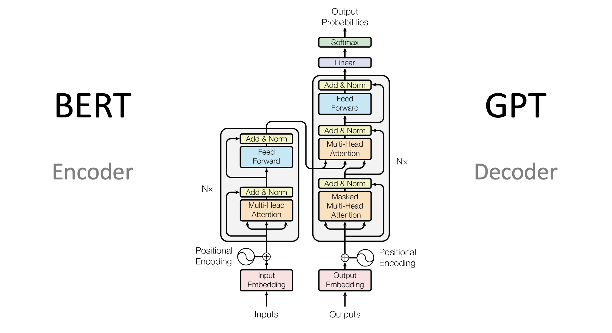

# Day_071 | Introduction to Transformer | Transformer Architecture

The **Transformer** architecture is a revolutionary neural network model introduced in 2017 that completely redefined the field of sequential data processing, particularly Natural Language Processing (NLP). It replaced the reliance on sequential processing (RNNs, LSTMs, GRUs) with the **Attention mechanism**, enabling massive parallelization and paving the way for modern Large Language Models (LLMs).

---

## 💡 Impact of the Transformer

The Transformer's impact is profound and widespread, shifting the focus of deep learning from recurrent processing to parallel attention-based processing:

* **Foundation for LLMs:** Every major modern LLM, including **GPT-3/4, BERT, Llama, Mistral, and T5**, is based on the Transformer architecture.
* **NLP Dominance:** Transformers quickly achieved state-of-the-art results across nearly all NLP tasks (translation, summarization, question answering, text generation).
* **Expansion to Other Domains:** The architecture was adapted for other sequence-based domains, including **Computer Vision (ViT - Vision Transformer)** and **Audio Processing (Audio Spectrogram Transformer)**, proving its universality.
* **Era of Pre-training:** The ability of the Transformer to be trained efficiently on massive, unlabelled datasets (like the entire internet) led to the era of large-scale pre-trained models.

---

## 🗺️ The Transformer Journey: From Recurrence to Attention

The development of the Transformer was a direct response to the limitations of previous sequence models:

1.  **RNNs/LSTMs (The Sequence Bottleneck):** Recurrent models process data one step at a time (e.g., word by word). This dependency on the previous step made training inherently slow and impossible to fully parallelize.
2.  **Attention in Seq2Seq (The Breakthrough):** The introduction of the **Attention mechanism** in 2015 allowed the Decoder to selectively focus on relevant parts of the Encoder's output, solving the fixed-size context vector bottleneck.
3.  **The Transformer (Attention Is All You Need, 2017):** The revolutionary step was the realization that **recurrence was unnecessary**. The entire model could be built solely on the Attention mechanism, specifically **Self-Attention**. This freed the model from sequential computation, allowing all parts of the input sequence to be processed simultaneously.

---

## 🏗️ Transformer Architecture

The Transformer follows the **Encoder-Decoder** structure but entirely replaces the recurrent layers with stacks of **Multi-Head Self-Attention** and **Feed-Forward Networks**.

### Key Components:

1.  **Positional Encoding:** Since the model has no recurrence, it needs a way to understand word order. Positional Encodings (fixed sine/cosine patterns) are added to the input embeddings to inject spatial/sequential information.
2.  **Multi-Head Self-Attention:** The core mechanism. It allows the model to weigh the importance of all other words in the sequence relative to the current word being processed. The "Multi-Head" part means the attention calculation is done several times in parallel, allowing the model to focus on different aspects of relationships (e.g., syntactic relationships, semantic relationships).
3.  **Feed-Forward Networks:** A standard MLP applied independently and identically to each position of the output sequence.
4.  **Encoder Stack:** Composed of identical layers, the Encoder processes the input sequence and extracts contextual representations.
5.  **Decoder Stack:** Composed of identical layers, the Decoder uses Self-Attention on the output sequence (masked to prevent "seeing" future words) and Cross-Attention to look at the Encoder's output, generating the final output sequence.

---

## ✅ Advantages and ❌ Disadvantages

### Advantages

* **Parallelization:** The primary advantage. Self-Attention allows computation for all tokens in the sequence to run at the same time, leading to dramatically faster training times on modern hardware (GPUs/TPUs).
* **Long-Range Dependencies:** Transformers capture dependencies between distant tokens better than LSTMs because the path length between any two tokens is always short (constant, usually 1).
* **Interpretability:** The attention weights provide a degree of interpretability, allowing researchers to see exactly which input tokens the model is focusing on for a given output.
* **Transfer Learning:** Highly effective for pre-training and fine-tuning.

### Disadvantages

* **High Computational Cost:** While training is parallel, the **Self-Attention mechanism** is computationally expensive. Its memory and time complexity is $O(N^2)$ with respect to the sequence length $N$. This limits the maximum sequence length a model can handle.
* **Positional Information:** The dependence on Positional Encoding is an artificial way to inject sequence order, which is not as inherent as the sequential nature of RNNs.
* **Generative Slowness:** In generation (autoregressive tasks), the decoding process is still sequential because the model must wait for the previous token to generate the next, reducing the benefit of parallelization during inference.

---

## 🔮 Future Work and Next Steps

The Transformer architecture is still the dominant foundation, but ongoing research focuses on mitigating its $O(N^2)$ complexity:

* **Efficient/Sparse Attention:** Models like **Performer** or **Reformer** aim to reduce the computational complexity from $O(N^2)$ to $O(N \log N)$ or even $O(N)$ by using sparse connections or mathematical approximations of the attention mechanism.
* **Mixture of Experts (MoE):** Architectures like those found in larger GPT models and **Mistral/Mixtral** use MoE to increase the total number of parameters (model capacity) without drastically increasing the computational cost during inference.
* **Recurrence and State Space Models:** There is a renewed interest in combining the strengths of recurrence with attention, or moving away from attention entirely toward architectures like **State Space Models (SSMs)**, such as **Mamba**, which offer fast inference and linear scaling with sequence length.

---

## **Introduction to Transformers**

Transformers are a deep learning architecture introduced in 2017 by Vaswani et al. in the paper *“Attention Is All You Need”*. Unlike earlier sequence models such as RNNs and LSTMs, transformers rely entirely on **self-attention mechanisms** to understand relationships between elements in a sequence.
This enables them to process data in parallel, capture long-range dependencies, and scale to very large models. Transformers have become the foundation for modern AI systems in natural language processing (NLP), computer vision, speech processing, and multimodal applications.

---

## **Impact of Transformers**

Transformers have transformed (literally) the field of artificial intelligence. Their major impacts include:

### **1. State-of-the-art Performance**

Transformers outperform previous neural models in tasks such as:

* Machine translation
* Text generation (GPT models)
* Summarization
* Classification
* Speech recognition
* Image generation (e.g., diffusion models with transformer components)

### **2. Scalability**

Transformers scale extremely well with data and computation, leading to massive models with billions or even trillions of parameters (e.g., GPT-4, Gemini, Llama 3).

### **3. Foundation Models**

Transformers enabled the rise of **foundation models**—pretrained models that can be fine-tuned for many downstream tasks, reducing the need for task-specific models.

### **4. Multimodal AI**

Transformers have bridged multiple modalities:

* Text + Image (e.g., CLIP, DALL·E)
* Text + Speech
* Text + Video
* Text + Code

### **5. Industry and Societal Impact**

They have influenced:

* Search engines
* Customer support bots
* Creative industries
* Education
* Healthcare
* Programming assistance
  They also raised important questions about safety, ethics, and responsible AI.

---

## **Transformer Journey (Evolution of Transformers)**

Here is a simplified timeline of the development of transformer models:

### **2017 – Birth of Transformers**

* *Attention Is All You Need* introduces the transformer architecture.
* Initially designed for machine translation.

### **2018 – Pretraining Revolution**

* **BERT**: Introduces bidirectional training for deep language understanding.
* **GPT-1**: Shows generative pretraining works for many tasks.

### **2019–2020 – Scaling Up**

* **GPT-2, GPT-3**: Larger models produce more coherent language generation.
* **T5** transforms all tasks into text-to-text formats.

### **2021 – Vision and Multimodal Transformers**

* **Vision Transformers (ViT)**: Transformers compete with CNNs in vision.
* **CLIP** and **DALL·E** mix text and images.

### **2022–2024 – Generative AI Explosion**

* Advanced language models (GPT-4, Gemini, Llama 2/3).
* Massive adoption for coding, reasoning, and content creation.

### **2024+ – Unified and Agentic AI**

* Models become agents capable of planning, reasoning, tool use, and multimodal understanding.

---

## **Advantages of Transformers**

### **1. Parallel Processing**

Unlike RNNs, transformers handle sequences in parallel, making them faster and easier to scale.

### **2. Long-Range Dependency Capture**

Self-attention helps models understand relationships between distant elements in a sequence.

### **3. Versatility**

Works across:

* Text
* Images
* Audio
* Video
* Multimodal tasks

### **4. Transfer Learning**

Pretrained transformers can be fine-tuned with small datasets.

### **5. Scalability**

Performance improves with more data, larger models, and more compute.

---

## **Disadvantages of Transformers**

### **1. High Computational Cost**

Training requires:

* Large GPUs/TPUs
* High energy consumption
* Expensive hardware

### **2. Data Hungry**

Transformers often need massive datasets for good performance.

### **3. Lack of Interpretability**

Self-attention is hard to interpret, making the decision process opaque.

### **4. Risk of Bias**

If trained on biased data, transformers can generate biased or harmful outputs.

### **5. Deployment Challenges**

Large models require:

* High memory
* Optimization for real-time use
* Specialized hardware

---

## **Future Work and Directions**

### **1. Efficient Transformers**

* Low-compute training
* Sparse attention
* Quantization and pruning
* Smaller models with high performance

### **2. Better Reasoning**

Push transformers to:

* Understand logic
* Perform multi-step reasoning
* Handle long-context memory

### **3. Multimodal General Intelligence**

Unify:

* Text
* Vision
* Audio
* Action
  Into a single reasoning model.

### **4. More Responsible and Safe AI**

* Reducing biases
* Controlling hallucinations
* Enhancing transparency and interpretability

### **5. Agentic AI**

Transformers as autonomous agents capable of:

* Planning
* Taking actions
* Using tools
* Interacting with the environment

### **6. Domain-Specific Optimizations**

Transformers adapted to:

* Healthcare
* Finance
* Robotics
* Scientific research

---

## Images

