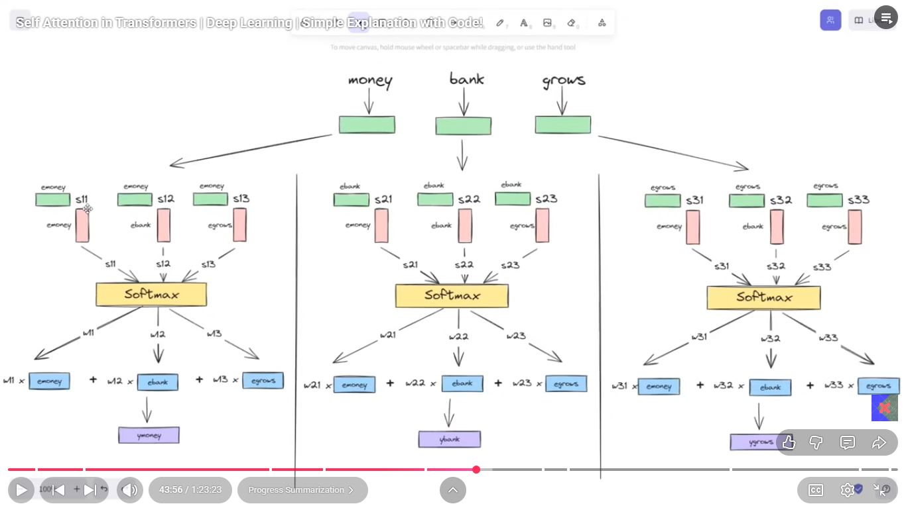
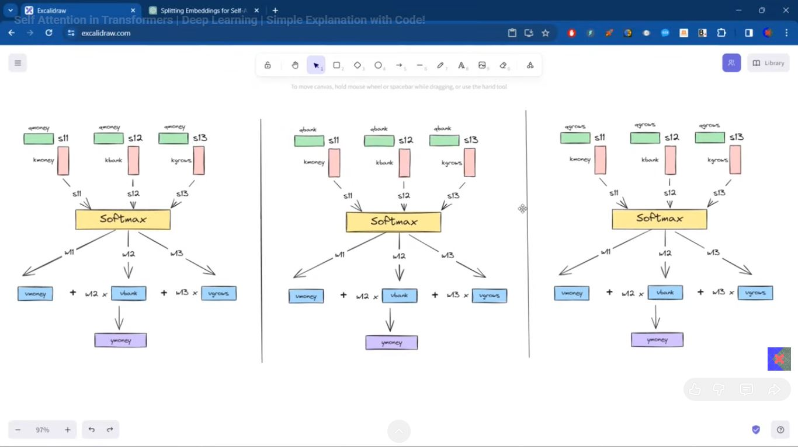
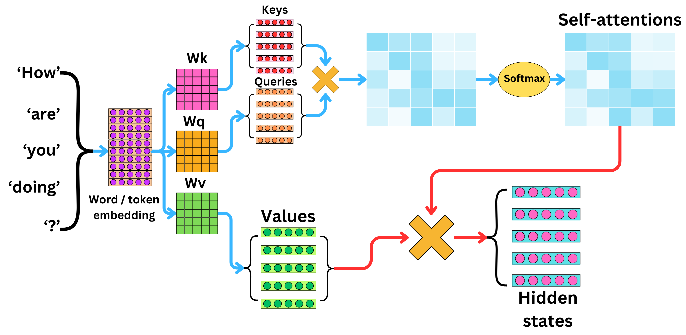
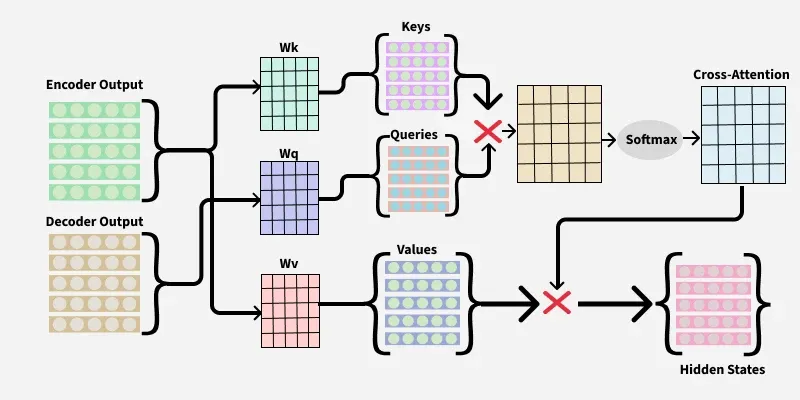
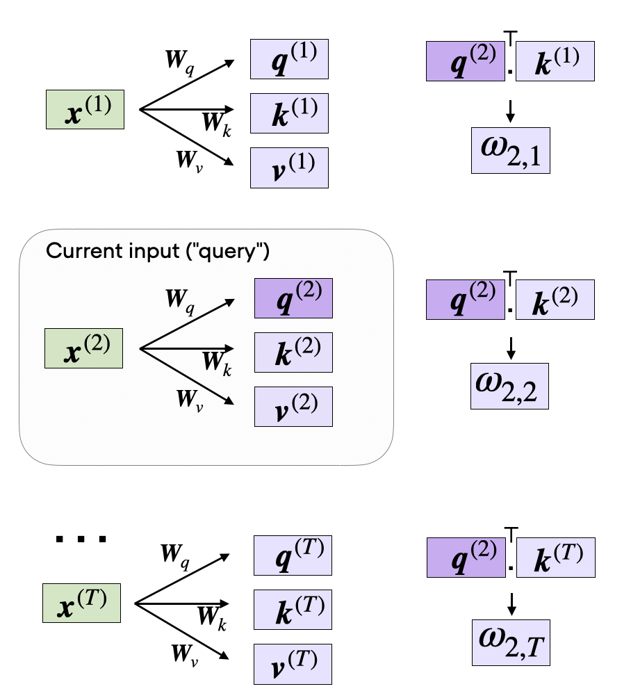

# Day_073 | 🔑 Self-Attention: How it Works (First Principles)

This is a deep dive into the core mechanics of the Transformer architecture. Self-Attention is a beautiful mechanism, and explaining it using the **first-principles approach** is the clearest way to understand its power.

---

## 🔑 Self-Attention: How it Works (First Principles)

The goal of Self-Attention is to create a **Contextualized Embedding** for every token in a sequence by weighing the importance of every other token in the same sequence. This entire process is driven by three learned vectors derived from the initial word embedding: **Query ($\mathbf{Q}$), Key ($\mathbf{K}$), and Value ($\mathbf{V}$)**.

### Overview
**Sentence:** *Money Bank Grows*, *River Bank Flows*

- **1st Sentence**: Money Bank Grows
    ```
    money = 0.6money + 0.3bank + 0.1grows
    bank = 0.25money + 0.7bank + 0.05grows
    grows = 0.01money + 0.29bank + 0.7grows

    ```

- **2nd Sentence**
    ```
    river = 0.5river + 0.3bank + 0.2flows
    bank = 0.2river + 0.7bank + 0.1flows
    flows = 0.29river + 0.1bank + 0.6flows

    ```
Here, we can see both are different sentence, bank word is same but content if different here with respect to his neighbour words

Here,\
0.7, 0.3. ..., 0.1 are similarity score between two word\
we can easily find by using *dot product* (e.g. $\mathbf{e}_{\text{money}} \cdot \mathbf{e}_{\text{bank}}$ )


### 1. The Core Idea: Query, Key, and Value

Imagine a retrieval system:
* **Query ($\mathbf{Q}$):** What I am looking for right now (the current word).
* **Key ($\mathbf{K}$):** What I have to offer (the current word's identifier/meaning).
* **Value ($\mathbf{V}$):** The actual information I want to retrieve and use (the current word's content).

For every word in the sequence, we use its Query to find matching Keys from **all** words (including itself). The level of match determines how much of that word's Value we pull into the current word's new, contextualized representation.

### 2. The Calculation Steps

Let the input sequence be $S = (\mathbf{x}_1, \mathbf{x}_2, \dots, \mathbf{x}_N)$.

#### Step 1: Compute Q, K, and V Vectors

For every input word embedding $\mathbf{x}_i$, three new vectors—$\mathbf{q}_i$, $\mathbf{k}_i$, and $\mathbf{v}_i$—are calculated using three separate, learned weight matrices ($\mathbf{W}_Q, \mathbf{W}_K, \mathbf{W}_V$).

$$
\mathbf{Q} = \mathbf{X} \mathbf{W}_Q \quad \text{where } \mathbf{X} \in \mathbb{R}^{N \times d_{\text{emb}}}, \mathbf{W}_Q \in \mathbb{R}^{d_{\text{emb}} \times d_k}
$$
$$
\mathbf{K} = \mathbf{X} \mathbf{W}_K \quad \text{where } \mathbf{X} \in \mathbb{R}^{N \times d_{\text{emb}}}, \mathbf{W}_K \in \mathbb{R}^{d_{\text{emb}} \times d_k}
$$
$$
\mathbf{V} = \mathbf{X} \mathbf{W}_V \quad \text{where } \mathbf{X} \in \mathbb{R}^{N \times d_{\text{emb}}}, \mathbf{W}_V \in \mathbb{R}^{d_{\text{emb}} \times d_v}
$$

* $\mathbf{X}$ is the matrix of all input word embeddings (plus positional encodings).
* $\mathbf{W}_Q$, $\mathbf{W}_K$, and $\mathbf{W}_V$ are the trainable weight matrices unique to the current attention head.

#### Step 2: Calculate Alignment Scores (Query $\times$ Key)

To determine the relevance between any two words $i$ and $j$, we calculate the dot product of the Query of word $i$ ($\mathbf{q}_i$) with the Key of word $j$ ($\mathbf{k}_j$). This yields a raw **alignment score** (or attention score). This is the key step where similarity is measured.

$$\text{Score}_{ij} = \mathbf{q}_i \cdot \mathbf{k}_j$$

*In matrix form, this is:*

$$\text{Scores} = \mathbf{Q} \mathbf{K}^T$$

#### Step 3: Scale and Apply Softmax (Normalization)

The scores are scaled by $\sqrt{d_k}$ (to stabilize gradients) and normalized using the **Softmax function** across the rows (across all keys) to get the final **Attention Weights ($\mathbf{A}$)**. These weights sum to 1 for each query, representing a probability distribution of importance.

$$\mathbf{A} = \text{Softmax}\left(\frac{\mathbf{Q} \mathbf{K}^T}{\sqrt{d_k}}\right)$$

#### Step 4: Compute Context Vector (Attention $\times$ Value)

The final contextualized output ($\mathbf{Z}$) is a weighted sum of the **Value vectors ($\mathbf{V}$)**, where the weights are the Attention Weights ($\mathbf{A}$).

$$\mathbf{Z} = \mathbf{A} \mathbf{V}$$

* Each row $\mathbf{z}_i$ of $\mathbf{Z}$ is the new contextualized embedding for word $i$, containing information pooled from the entire sequence, weighted by relevance.

---

## 🏦 Example: "money bank grow"

Consider the short sequence $S = (\text{"money"}, \text{"bank"}, \text{"grow"})$. We want to find the contextual embedding for the word **"bank"** ($\mathbf{x}_{\text{bank}}$).

| Word | Vector Role | Calculation | Intuition |
| :--- | :--- | :--- | :--- |
| **"bank"** | **Query ($\mathbf{q}_{\text{bank}}$)** | $\mathbf{x}_{\text{bank}} \mathbf{W}_Q$ | *What context do I need to understand myself?* |
| **"money"** | **Key ($\mathbf{k}_{\text{money}}$)** | $\mathbf{x}_{\text{money}} \mathbf{W}_K$ | *What meaning do I offer?* |
| **"grow"** | **Key ($\mathbf{k}_{\text{grow}}$)** | $\mathbf{x}_{\text{grow}} \mathbf{W}_K$ | *What meaning do I offer?* |

1.  **Alignment Scores:** $\text{Score}_{\text{bank, money}} = \mathbf{q}_{\text{bank}} \cdot \mathbf{k}_{\text{money}}$
    * *Result:* This score is likely high because "money" is highly relevant to a financial "bank."
    $\text{Score}_{\text{bank, grow}} = \mathbf{q}_{\text{bank}} \cdot \mathbf{k}_{\text{grow}}$
    * *Result:* This score is likely low unless the context is financial growth.
2.  **Attention Weights ($\alpha$):** After Softmax, $\alpha_{\text{bank, money}}$ will be significantly higher than $\alpha_{\text{bank, grow}}$.
3.  **Contextual Embedding ($\mathbf{z}_{\text{bank}}$):**
    $$
    \mathbf{z}_{\text{bank}} = \alpha_{\text{bank, money}} \mathbf{v}_{\text{money}} + \alpha_{\text{bank, bank}} \mathbf{v}_{\text{bank}} + \alpha_{\text{bank, grow}} \mathbf{v}_{\text{grow}}
    $$
    The new embedding $\mathbf{z}_{\text{bank}}$ will be strongly influenced by the **Value vector of "money,"** thus resolving the ambiguity and confirming the financial meaning.

---

## 🤝 General vs. Task-Specific Contextual Embeddings

### General Contextual Embeddings (The Transformer Output)

The raw output ($\mathbf{Z}$) of the Self-Attention mechanism provides **General Contextual Embeddings**.

* **Definition:** These vectors capture the general semantic and syntactic relationships between words in the sequence. For example, the vector for "bank" knows it relates to "money" in this context.
* **Goal:** To serve as a high-quality, sequence-aware input for any downstream task. (This is the output of the final BERT layer).

### Task-Specific Contextual Embeddings

These are the final output embeddings after the General Contextual Embeddings have been processed by the final layers of the model.

* **Definition:** These vectors are fine-tuned to solve a specific goal (e.g., classification, summarization).
* **Goal:** To contain the minimal, essential information needed for the final task layer (e.g., a Softmax classifier) to succeed.

### Technique to Transform (Fine-Tuning)

The transformation from **General** to **Task-Specific** is accomplished through **Fine-Tuning**:

1.  **Attach a Head:** A simple, task-specific layer (a **Classification Head**) is added on top of the pretrained Transformer's output.
2.  **Train:** The entire model (both the Transformer layers and the new head) is trained for a few epochs on a small, labeled, task-specific dataset (e.g., sentiment analysis reviews).
3.  **Result:** The backpropagation process adjusts the weights of the Transformer (especially the top layers) and the new head, subtly shifting the General Embeddings to focus on features most relevant to the new task (e.g., maximizing the difference between positive and negative words).

---

## ❓ Why Different Q, K, V Matrices are Needed

It's necessary to use three separate weight matrices ($\mathbf{W}_Q, \mathbf{W}_K, \mathbf{W}_V$) instead of just using the initial embedding $\mathbf{x}$ for all three roles for three main reasons:

1.  **Differentiating Roles:** Using separate matrices ensures that the three vector types serve distinctly different purposes:
    * $\mathbf{Q}$: Learns to extract the **meaning we are looking for** (the search criteria).
    * $\mathbf{K}$: Learns to extract the **unique identifier** of the word for easy retrieval.
    * $\mathbf{V}$: Learns to extract the **content** to be retrieved.
2.  **Modeling Non-linearity:** Without separate matrices, the attention calculation would simply be $\mathbf{x}_i \cdot \mathbf{x}_j$, which limits the complexity of the relationships the model can capture (it's a simple cosine similarity). The transformation matrices allow the model to apply a non-linear projection, mapping the input into a space better suited for measuring "relevance."
3.  **Increased Capacity:** Separating the matrices drastically increases the number of trainable parameters, which increases the model's capacity to learn complex relationships, particularly when combined with **Multi-Head Attention**.

---

## **1. The Problem Transformers Solve**

Traditional NLP representations (OHE, BoW, TF-IDF, Word2Vec) fail because:

* They assign **one static vector per word**
  → “bank” = same vector in *river bank* and *money bank*
* They cannot understand **context**, **relationships**, or **long-distance dependencies**

Transformers fix this by building **contextual embeddings** using **self-attention**.

---

## **2. What Is Self-Attention (First Principles)**

Self-attention answers one question:

> **“When processing a word, which other words in the sequence matter, and how much?”**

To answer this, the model learns three different views of each embedding:

* **Query (Q)**: What this word is *looking for*
* **Key (K)**: What this word *offers*
* **Value (V)**: What information this word carries

These three views allow the model to compute how strongly any word should attend to every other word.

---

## **3. Why Q, K, V?

Why not just use the embedding directly?**

Because a single embedding cannot simultaneously serve:

* as a **search signal** (Query)
* as a **matching target** (Key)
* as a **content carrier** (Value)

These are fundamentally different roles.

Imagine humans:

* You search for information using **queries** (what you want to know).
* You match sources using **keys** (what others provide).
* You consume **values** (the actual information).

You cannot use one vector for all three roles because:

### **Reason 1 — Separation of roles**

Q compares with K.
V carries meaning.
They serve different mathematical roles.

### **Reason 2 — Multi-head attention**

Each head can learn:

* syntax relations
* semantic relations
* long-term dependencies
* positional relationships

Using multiple learned Q/K/V projections allows each head to focus on different patterns.

### **Reason 3 — Context mixing flexibility**

Q, K, and V mappings give transformers the ability to create **different contextual embeddings for the same word depending on context**.

---

## **4. How Q, K, V Are Calculated from an Embedding**

Given a word embedding vector **x** (e.g., 768-dim):

The transformer learns three projection matrices:

* ( W_Q ) – for queries
* ( W_K ) – for keys
* ( W_V ) – for values

Then:

[
Q = xW_Q, \quad K = xW_K, \quad V = xW_V
]

These are learned during training.

* **Same input embedding → different Q, K, V**
* **Different heads → different Q/K/V projections**

Thus, each head specializes.

---

## **5. Attention Score Calculation (First Principles)**

To compute how much word *i* should attend to word *j*:

$$
\text{score}(i,j) = Q_i \cdot K_j^T
$$

Then apply softmax to convert scores → attention weights:

$$
\alpha_{ij} = \text{softmax}(\text{score}(i,j))
$$

Finally, use these weights to blend the values:

$$
\text{context}*i = \sum_j \alpha*{ij} V_j
$$

This gives a **contextual embedding** for each word.

---

## **6. A Simplified Walkthrough with “money bank grow”**

Let’s analyze:

> **"money bank grow"**

We want:

* “bank” meaning = financial institution
* “money” gives its context
* “grow” modifies the meaning (bank investments grow)

### **Step 1 — Start with embeddings**

```
x_money
x_bank
x_grow
```

### **Step 2 — Compute Q, K, V**

For each word:

```
Q_money = x_money · W_Q
K_money = x_money · W_K
V_money = x_money · W_V

Q_bank  = x_bank  · W_Q
K_bank  = x_bank  · W_K
V_bank  = x_bank  · W_V

Q_grow  = x_grow  · W_Q
K_grow  = x_grow  · W_K
V_grow  = x_grow  · W_V
```

### **Step 3 — Compute attention scores for “bank”**

“bank” attends to:

* **money**
* **bank**
* **grow**

Compute dot products:

```
score(bank → money) = Q_bank · K_money
score(bank → bank)  = Q_bank · K_bank
score(bank → grow)  = Q_bank · K_grow
```

### Expected behavior:

* bank ↔ money should have **high** score
  (financial meaning reinforcement)
* bank ↔ grow moderate
  (related through investment growth)
* bank ↔ bank (self) moderate
  (self-identity)

### **Step 4 — Softmax → Attention weights**

Normalize:

```
α(bank→money), α(bank→bank), α(bank→grow)
```

### **Step 5 — Blend values to get contextual “bank”**

$$
\text{bank}*{contextual}
= α*{bank→money}V_{money}

* α_{bank→bank}V_{bank}
* α_{bank→grow}V_{grow}
$$

Result:

* The word **bank** now means **financial-bank**, not river-bank.
* Because it attended strongly to **money** and **grow**.

This is **contextual embedding**.

---

## **7. General vs. Task-Specific Contextual Embeddings**

Transformers build two levels of contextualization:

---

## **A. General Contextual Embeddings (Pretraining)**

During pretraining (e.g., BERT, GPT), the model learns:

* syntactic relationships
* semantic relationships
* world knowledge
* context-driven interpretation

Examples:

* “bank” gets different contextual embeddings in different sentences.
* “grow” linking with financial concepts.

These representations are **general-purpose**, not tied to tasks.

---

## **B. Task-Specific Contextual Embeddings (Fine-tuning)**

During fine-tuning:

* The same transformer weights are adjusted slightly.
* The general embeddings adapt to optimize a task.

Example:

* For a **sentiment classifier**, contextual embeddings emphasize emotional tone.
* For **named entity recognition**, embeddings highlight entity boundaries.
* For **financial forecasting**, embeddings highlight economic terms.

This process is:

> **General → Task-specific contextualization**

---

## **8. How Transformers Convert General → Task-Specific Contextual Embeddings**

Technique: **parameter fine-tuning**

1. Start with pretrained weights (general)
2. Add a task-specific head
   (classifier, decoder, QA head, etc.)
3. Backpropagate the task loss:

   * updates task head
   * also slightly updates Q/K/V projections and transformer layers
   * embeddings become aligned with the task’s meaning

Other variations:

* LoRA (low-rank adapters)
* Prefix-Tuning
* Prompt-Tuning
* BitFit

But fundamentally:

> **Fine-tuning changes how attention behaves → changes contextual meaning for tasks.**

---

## **9. Why Self-Attention Produces Contextual Embeddings**

Self-attention allows:

* every word to view every other word
* context to determine meaning
* long-shots (“money” affects “bank”)
* role-awareness (“grow” modifies “bank”)
* dynamic meaning per sentence

This flexibility is what transforms:

* static embeddings → **contextual embeddings**
* general contextual embeddings → **task-specific embeddings**

---

## **10. Summary Table**

| Component            | Purpose                                      |
| -------------------- | -------------------------------------------- |
| Embedding            | Base meaning of a word                       |
| Q (Query)            | What the word wants to find                  |
| K (Key)              | What the word offers to match with others    |
| V (Value)            | The meaning to be aggregated                 |
| Attention Scores     | How strongly one word relates to another     |
| Contextual Embedding | Meaning updated using surrounding words      |
| Pretrained Model     | Produces general contextual embeddings       |
| Fine-tuned Model     | Produces task-specific contextual embeddings |

---

## **11. Final Explanation (One Sentence)**

> **Self-attention transforms static word embeddings into deeply contextual, task-aware representations by learning how each word should attend to every other word in the sequence using learned Q, K, and V projections.**

---

## Images




