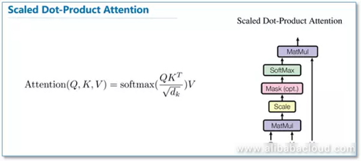

# Day_074 | 📐 What is Scaled Dot-Product Attention?

The **Scaled Dot-Product Attention** mechanism is a critical component of the **Transformer** architecture. The reason for scaling is primarily to ensure stable training and prevent the **Softmax function** from running into regions where its gradient is extremely small, which would hinder the learning process.

---

## 📐 What is Scaled Dot-Product Attention?

The formula for Scaled Dot-Product Attention is:

$$\text{Attention}(\mathbf{Q}, \mathbf{K}, \mathbf{V}) = \text{Softmax}\left(\frac{\mathbf{Q} \mathbf{K}^\top}{\sqrt{d_k}}\right) \mathbf{V}$$

The term $\frac{1}{\sqrt{d_k}}$ is the **scaling factor**.

* $\mathbf{Q}$ (Query) and $\mathbf{K}$ (Key) are the input matrices.
* $d_k$ is the **dimension of the Key vectors**.

---

## 🛑 Why We Need to Scale Self-Attention

The scaling factor $\frac{1}{\sqrt{d_k}}$ is necessary to combat the issue of **large input magnitudes** to the Softmax function, which can lead to vanishing gradients.

### 1. The Problem of Large Dot Products

The dot product of two vectors, $\mathbf{q}$ and $\mathbf{k}$, grows larger in magnitude as the dimension of the vectors ($d_k$) increases.

* If the components of $\mathbf{q}$ and $\mathbf{k}$ are independent random variables with mean 0 and variance 1, their dot product $\mathbf{q} \cdot \mathbf{k}$ has a mean of 0 and a variance of $d_k$.
* As $d_k$ grows large (e.g., 512, 1024), the variance of the dot products also grows, making the resulting attention scores very large in magnitude (both positive and negative).

### 2. The Impact on Softmax Gradients (Vanishing Gradient)

The Softmax function ($\text{Softmax}(x) = \frac{e^x}{\sum e^x}$) is highly sensitive to large input values:

* **Large Positive Scores:** When the dot products are very large and positive, the corresponding $e^x$ term becomes huge, and the Softmax output approaches 1.
* **Large Negative Scores:** When the dot products are very large and negative, the Softmax output approaches 0.

In both extreme cases (outputs close to 0 or 1), the **derivative** of the Softmax function (its gradient) becomes very close to **zero**.

$$\text{Derivative of Softmax} \approx 0$$

If the gradient is near zero, **Backpropagation** cannot effectively update the weights ($\mathbf{W}_Q$ and $\mathbf{W}_K$). This is the **Vanishing Gradient problem**, which prevents the model from learning the correct attention weights.

### 3. The Scaling Solution

Dividing the dot product by $\sqrt{d_k}$ **normalizes the variance** of the attention scores back to 1.

$$\text{Variance}\left(\frac{\mathbf{q} \mathbf{k}^\top}{\sqrt{d_k}}\right) = \frac{\text{Variance}(\mathbf{q} \mathbf{k}^\top)}{d_k} = \frac{d_k}{d_k} = 1$$

By ensuring the scores fed into the Softmax function have a controlled, stable variance, the inputs remain in a moderate range. This keeps the Softmax output away from the extreme values of 0 and 1, ensuring the gradients remain sufficiently large to allow for **effective and stable learning**.

---

In **Scaled Dot-Product Attention**, we apply the formula:

$$
\text{Attention}(Q, K, V) = \text{softmax}\left(\frac{QK^\top}{\sqrt{d_k}}\right)V
$$

The key question: **Why do we divide by ($\sqrt{d_k}$)?**

---

## ✅ **Short Answer**

Because **without scaling, the dot products grow too large as the dimensionality increases**, causing the **softmax to saturate**, which leads to **tiny gradients** and makes learning unstable and slow.

---

## 🔍 **Detailed Explanation**

### 1. **Dot products grow with vector dimension**

If the query and key vectors have dimension ($d_k$), and their components have mean 0 and variance 1, then:

* The dot product ($Q \cdot K$) has:

  * **mean = 0**
  * **variance = ($d_k$)**

This means:

* For large ($d_k$), dot products become large.
* Example: if ($d_k = 512$), raw dot products are roughly on the order of ($\sqrt{512} \approx 22$).

---

### 2. **Softmax becomes extremely peaky**

When you feed large numbers into softmax:

$$
\text{softmax}(x_i) = \frac{e^{x_i}}{\sum_j e^{x_j}}
$$

Large input values → exponentials blow up → one value dominates.

This produces:

* Attention = almost a one-hot vector
* **Very small gradients (softmax saturates)**
* **Training becomes unstable**

---

### 3. **Scaling solves this**

Dividing by (\sqrt{d_k}) normalizes variance:

$$
\text{Var}\left(\frac{QK^\top}{\sqrt{d_k}}\right) = 1
$$

Now:

* Softmax sees **well-behaved values**
* Gradients stay healthy
* Training remains stable, especially in deep transformers

---

## 📌 **Intuition**

Think of it like trying to read scores on a thermometer:

* Without scaling: it's like using a thermometer that jumps from 0°C to 200°C instantly → no precision.
* With scaling: we normalize the temperature range → values are smooth and differentiable.

---

## 🧠 In simple terms

**We scale dot-product attention so that:**

* The model doesn’t get overwhelmed by large numbers.
* Softmax doesn’t collapse.
* Gradients don’t vanish.
* Training is stable and fast.

---

## 📝 Bonus: Why don’t we scale additive attention?

Additive attention (Bahdanau):

$$
\text{score}(Q, K) = v^\top \tanh(W_1Q + W_2K)
$$

Its values are already controlled by:

* tanh (bounded output)
* learned linear layers

So **no scaling needed**.

---

## Images
