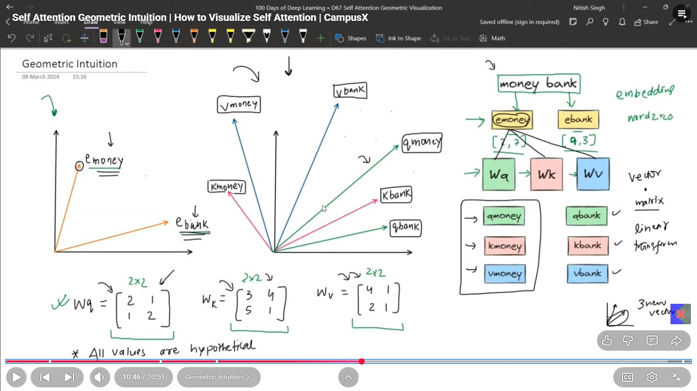
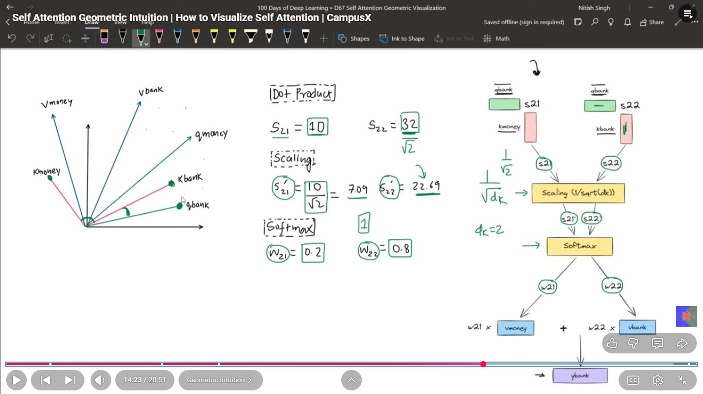
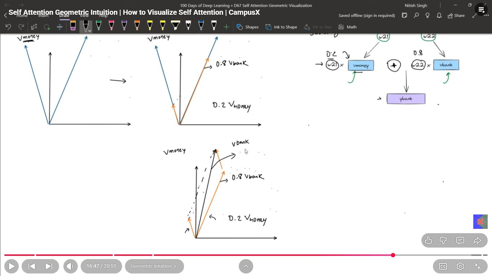
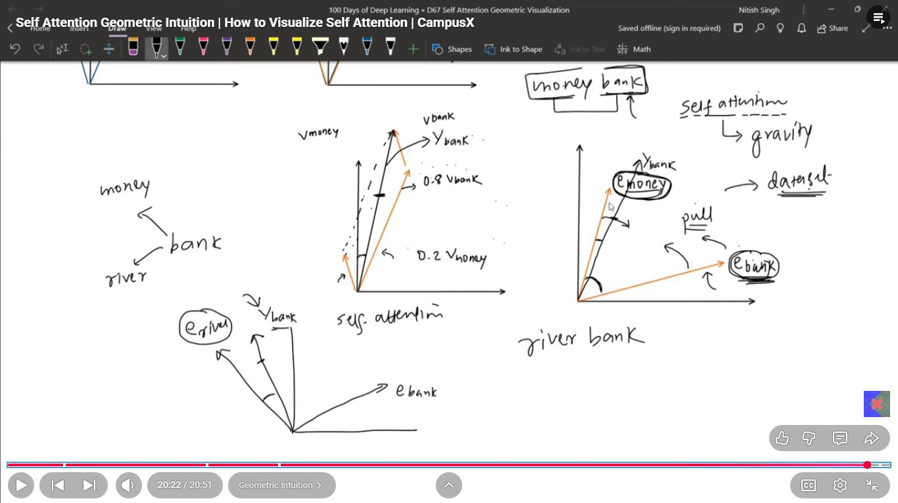

# Day_075 | ✨ Self-Attention Geometric Intuition

The geometric intuition behind Self-Attention lies in understanding how it dynamically **transforms** a word's position in the embedding space based on the surrounding context. It's essentially a form of **weighted averaging** of content in the embedding space.

---

## 1. The Core Geometric Concept: Weighted Sum

Imagine all words in a sentence existing as points in a high-dimensional vector space.

1.  **Initial Embeddings (Static):** Every word starts at a fixed position in the embedding space (its initial token embedding).
2.  **The Attention Goal:** The goal is to move the current word's point to a new location that reflects its meaning in *this specific sentence*.
3.  **The Geometric Move:** The new, **contextualized embedding** ($\mathbf{z}_i$) for word $i$ is calculated as a **weighted average** of the **Value vectors ($\mathbf{v}_j$)** of *all* words in the sequence.

$$\mathbf{z}_i = \sum_{j=1}^{N} \alpha_{ij} \mathbf{v}_j$$

* The $\mathbf{v}_j$ vectors represent the content (the destination points).
* The **Attention Weights ($\alpha_{ij}$)** are the coefficients (the distance/importance).

The final point ($\mathbf{z}_i$) lands closer to the Value vectors of the words it is paying the most attention to.

---

## 2. The Role of Q, K, and V in the Space

The three key vectors define the geometry of the operation:

| Vector | Geometric Role | Intuition |
| :--- | :--- | :--- |
| **Query ($\mathbf{Q}$)** | **The Searcher:** Defines the *direction* and *focus* of the current word's required context. | *Where should I look?* |
| **Key ($\mathbf{K}$)** | **The Identifier:** Defines the unique *position* or *signature* of every word in the retrieval space. | *What am I offering?* |
| **Value ($\mathbf{V}$)** | **The Content:** Defines the final *content vector* that is aggregated and moved. | *What information will be aggregated?* |

The **dot product** in $\mathbf{Q} \mathbf{K}^\top$ is a geometric measure of **similarity** or **alignment** between the Query's focus and the Key's identity. If $\mathbf{q}_i$ is highly aligned with $\mathbf{k}_j$ (i.e., the angle between them is small), the score is high, the weight $\alpha_{ij}$ is high, and the $\mathbf{v}_j$ vector will contribute significantly to the new position $\mathbf{z}_i$.

---

## 3. How to Visualize Self-Attention

Self-Attention is typically visualized using **Attention Head Maps** or **Saliency Maps**.

### A. Attention Head Maps

The most common visualization is a **heatmap** generated directly from the **Attention Weights ($\mathbf{A}$)** matrix.

* **Structure:** This is an $N \times N$ matrix, where $N$ is the sequence length.
* **Axes:** The Y-axis represents the **Query** (the word being processed), and the X-axis represents the **Key/Value** (the word being attended to).
* **Interpretation:** A bright cell at position $(i, j)$ means that when the model processes the word $i$ (Query), it is paying strong attention (high $\alpha_{ij}$) to the word $j$ (Key).

#### Visualization Example

For the sentence: "The **cat** sat on the **mat**."

1.  **Query = "cat":** We look at the row corresponding to "cat."
2.  **Focus:** The brightest cells in this row will likely be for "the," "sat," and itself ("cat").
3.  **Context:** The visualization shows that the embedding for "cat" is formed by strongly weighting the content of related words like "sat" and "mat."

### B. Syntactic and Semantic Heads

In **Multi-Head Attention**, the architecture uses multiple heads in parallel, each learning different attention patterns. Visualization reveals that these heads specialize:

* **Syntactic Heads:** Some heads consistently track grammatical relationships (e.g., subject always attends to its verb).
* **Semantic Heads:** Other heads focus on relationships that define meaning (e.g., a pronoun attends to its antecedent).

By visualizing these specialized heads, researchers gain intuition into *how* the Transformer structures the input information before making a final prediction.

Here’s a clear, intuitive, geometry-driven explanation of **self-attention** — plus several visualization strategies you can use to “see” how it works.

---

## **1. Each token becomes a point in a high-dimensional space**

Before attention happens, each token (word, subword, etc.) is mapped to a vector
→ a *point* in a high-dimensional semantic space.

Think of a sentence like:

> “The cat sat on the mat.”

Each token = a point in ℝᵈ.

---

## **2. Query–Key similarity is literally a *dot-product angle test***

Self-attention computes:

* **Query (Q)**: “What am I looking for?”
* **Key (K)**: “What do I offer?”
* **Value (V)**: “What information I give if selected”

Geometrically:

### **Q·K = |Q||K| cos(θ)**

A *large positive* dot product means:

* Small angle → vectors align → strong attention.

So attention is essentially:

> “For this token’s query vector, which key vectors point in a similar direction?”

This is pure geometry.

---

## **3. Softmax turns similarities into a probability distribution**

Softmax(Q·Kᵀ) produces **attention weights**.
Visually, imagine:

* Every token is a point.
* The query creates a *cone* of focus.
* Tokens inside a tighter angle get higher weights.
* Far-angle tokens get suppressed to near zero.

---

## **4. The Value vectors get blended (a weighted sum)**

Geometrically:

> The output for a token is the **center of mass** of the Value vectors,
> weighted by relevance.

So the representation moves toward points it “attends” to.

This is the key geometric picture:

### **Self-attention = move each point toward other nearby points (in angle space) based on learned similarity.**

---

## 🔍 **How to *Visualize* Self-Attention (Practical Views)**

Below are different ways researchers visualize it.

---

## **1. Heatmaps**

Rows = queries, columns = keys, darker = stronger attention.

Geometric meaning:
Shows which points sit within the same “semantic direction cone.”

---

## **2. Graph view (edges weighted by attention)**

Tokens are nodes; attention weights are edges.

Interpretation:
Shows dynamic connectivity between words — the attention graph.

---

## **3. Vector-angle plots (2D PCA/UMAP)**

Project Q/K vectors into 2D or 3D using PCA or UMAP.

What you’ll see:

* Clusters of syntactic or semantic roles.
* Lines showing which vectors align (high dot-product).

---

## **4. Attention rollout / flow across layers**

Shows how information diffuses through the network.

Geometrically:

* The point-cloud is repeatedly warped layer by layer.

---

## **5. Cone Projection (the intuitive one!)**

Plot Keys as dots on a sphere → Queries as direction vectors.

Tokens inside the “attention cone” get high weights.

This is one of the best ways to see attention as geometry.

---

## 🧠 **Putting it all together with an intuition story**

Imagine you’re focusing on the word **“cat”**.

1. “cat” produces a **query vector** representing “look for subject–verb relations.”
2. Every other token has a **key vector** representing what it *is*.
3. Tokens with compatible meaning/direction —
   e.g., **“sat”** — have small angles → strong similarity.
4. Softmax gives “sat” a high weight.
5. The output for “cat” becomes a weighted combination of values —
   pulling its representation toward the action related to it.

The geometry:

### **Every token rotates and shifts in space based on who it attends to.**

The model learns to align Q/K directions to encode grammar and meaning.

---

## 📌 Quick Summary (TL;DR)

| Operation              | Geometric Interpretation                                     |
| ---------------------- | ------------------------------------------------------------ |
| Embedding              | Token → point in space                                       |
| Query–Key dot product  | Angle test: alignment = similarity                           |
| Softmax                | Normalize attention into probability cone                    |
| Weighted sum of Values | Move token toward weighted center of mass                    |
| Multi-head             | Multiple geometric projections pick different relation types |

Self-attention =

> “Dynamic geometric reconfiguration of the point-cloud of tokens.”

---

## Images

