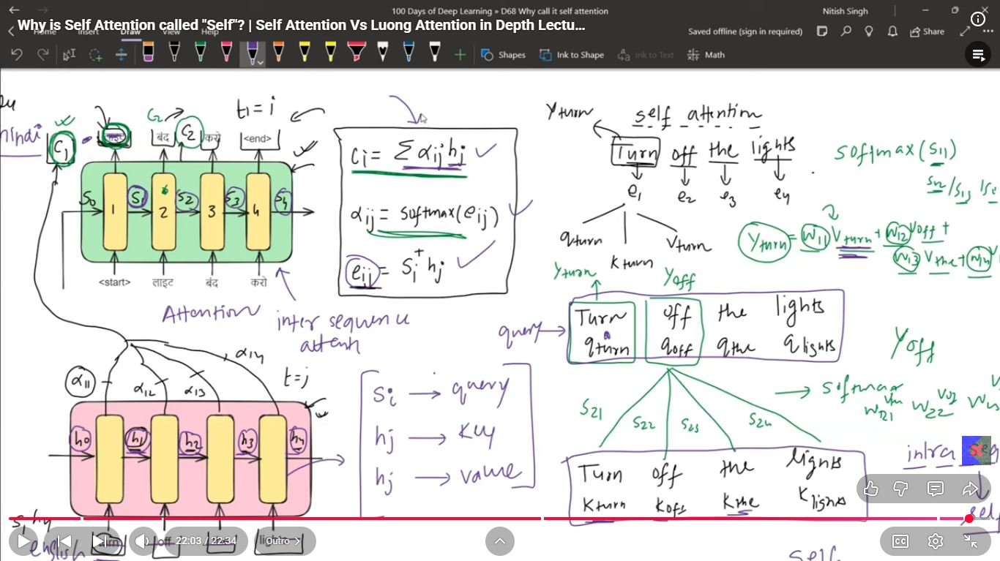

# Day_076 | ❓ Why is Self-Attention Called "Self"?

The term **"Self-Attention"** is used because the attention mechanism calculates the relationships **within the same sequence**. It's an internal process where every element in the input sequence attends to **every other element in that exact same sequence** (including itself) to compute a better representation.

* **Self-Referential:** For a given word, the Query vector is used to look up all Key vectors that originated from the same input sentence.
* **Contrast:** In the older **Encoder-Decoder Attention (Cross-Attention)**, the **Query** came from the **Decoder** and the **Keys/Values** came from the **Encoder** (two different sources). Self-Attention removes this cross-component.

---

## 🆚 Self-Attention vs. Luong Attention: A Deep Dive

The fundamental difference lies in their **purpose, architecture, and complexity**. While both use the core attention formula (Query-Key similarity followed by Softmax and multiplication by Value), they apply this mechanism in entirely different contexts.

| Feature | Self-Attention (Intra-Attention) | Luong Attention (Inter-Attention/Cross-Attention) |
| :--- | :--- | :--- |
| **Primary Goal** | **Contextualization:** To create a new, context-aware embedding for every token within a single sequence. | **Alignment/Transfer:** To align a target sequence (Decoder) with a source sequence (Encoder). |
| **Q, K, V Source** | All three (Q, K, V) are derived from the **SAME** sequence's embeddings. | **Query (Q):** Decoder's hidden state. **Keys (K) & Values (V):** Encoder's output hidden states. |
| **Mechanism** | The output sequence is a more meaningful representation of the input sequence. | The output is the weighted context vector passed to the decoder's output layer. |
| **Where Used** | **Transformer Encoder** and **Transformer Decoder** (first sublayer). | **RNN Encoder-Decoder** and **Transformer Decoder** (second sublayer). |
| **Output Type** | A sequence of **Contextual Embeddings** ($\mathbf{Z}$). | A single **Context Vector** ($\mathbf{C}_t$). |
| **Recurrence Needed** | No. **Fully parallelizable.** | Yes (in the RNN context). The decoder processes one step at a time. |

### 1. Luong Attention (The RNN Context)

Luong attention (specifically the Global variant) is an improvement on the **RNN Encoder-Decoder** model.

* **Calculation Location:** The scoring function often uses the **current decoder hidden state** ($\mathbf{h}_t^{\text{dec}}$) as the Query.
* **The Mismatch:** Luong (and Bahdanau) attention are needed because the RNN Encoder and Decoder are separate models speaking different "languages." Attention helps align the relevant parts of the source language (Encoder Keys/Values) with the target language being generated (Decoder Query).
* **Complexity:** Luong attention introduced simpler scoring functions (Dot or General) compared to Bahdanau's additive approach.

$$\text{Score}_{\text{Luong}} = (\mathbf{h}_t^{\text{dec}})^\top \mathbf{W} \mathbf{h}_i^{\text{enc}}$$

### 2. Self-Attention (The Transformer Context)

Self-Attention is the building block of the **Transformer**, eliminating the need for recurrence.

* **The Key Transformation:** The input $\mathbf{X}$ is transformed into $\mathbf{Q}, \mathbf{K}, \mathbf{V}$ using three learned weight matrices ($\mathbf{W}_Q, \mathbf{W}_K, \mathbf{W}_V$).
* **The Parallelism:** Since all relationships are computed simultaneously (using $\mathbf{Q} \mathbf{K}^\top$), the model instantly knows the global context for every word, enabling parallel processing.
* **The Final Step:** The output is calculated using the Scaled Dot Product:

$$\text{Attention}(\mathbf{Q}, \mathbf{K}, \mathbf{V}) = \text{Softmax}\left(\frac{\mathbf{Q} \mathbf{K}^\top}{\sqrt{d_k}}\right) \mathbf{V}$$

### Conclusion

While Luong attention fixed a flaw in RNNs by bridging two sequences, **Self-Attention** is a more fundamental architectural primitive that created a *single, powerful representation* of a sequence, enabling the massive scaling and parallelization that defines modern LLMs.

---

## 🎯 **1. Why is it called *Self*-Attention?**

**Self-attention** means that the model computes attention **within the same sequence** — the sequence attends to *itself*.

For each token **tᵢ**:

* Query = representation of tᵢ
* Keys = representations of *all tokens in the same sequence*
* Values = same-sequence values

So word *i* looks at *every other word j* in the **same sequence**, including itself.

Hence the name:

> **Self-attention** = “attention over *self* (the same sequence), not over another sequence.”

This is in contrast to **cross-attention**, where:

* Queries come from one sequence (decoder)
* Keys/Values from another sequence (encoder)

---

## 🔁 **2. What is Luong Attention? (Context: Seq2Seq RNNs)**

Luong (and Bahdanau) attention are used in **Encoder–Decoder RNN architectures**.

**Luong Attention = Decoder attends to *encoder* hidden states**
→ therefore it is **NOT self-attention**.

The decoder time step t produces:

* Query = decoder hidden state hₜᵈ
* Keys/Values = encoder hidden states {h₁ᵉ … hₙᵉ}

The decoder looks at a *different sequence* → the encoder output.

This is **cross attention**, not self-attention.

---

## 🆚 **3. Self-Attention vs Luong Attention (Core Differences)**

Below is a conceptual comparison.

---

## **(A) Source of Queries, Keys, and Values**

| Mechanism           | Queries         | Keys / Values | Why “self”?                          |
| ------------------- | --------------- | ------------- | ------------------------------------ |
| **Self-Attention**  | Sequence itself | Same sequence | YES — attention within same sequence |
| **Luong Attention** | Decoder         | Encoder       | NO — attention across sequences      |

---

## **(B) Role in the architecture**

| Mechanism          | Main role                                                                         |
| ------------------ | --------------------------------------------------------------------------------- |
| **Self-Attention** | Build contextualized embeddings inside the encoder/decoder layers of transformers |
| **Luong**          | Allow decoder steps to read the encoder (RNN-based seq2seq)                       |

---

## **(C) Computational properties**

| Property                | Self-Attention            | Luong                                  |
| ----------------------- | ------------------------- | -------------------------------------- |
| Complexity              | O(n²) pairwise operations | O(n·m) encoder-decoder pairs           |
| Parallelizable?         | Fully parallelizable      | No (RNN is sequential)                 |
| Global receptive field? | YES in one step           | No (decoder uses RNN memory+attention) |

---

## **(D) Geometric Interpretation**

**Self-attention:**
Each token acts as a *query vector* that looks around a cloud of token vectors and gathers context from itself and its neighbors.

**Luong attention:**
Decoder timesteps act as queries scanning the encoder space to find relevant information.

Analogy:

* **Self-attention** = people sitting in a circle, each looking around at each other at the same time.
* **Luong attention** = teacher (decoder) looking at student notes (encoder outputs).

---

## 🧠 **4. Deeper Intuition: Why Self-Attention is Powerful**

### **1. It contextualizes every token by every other token in one shot**

No recurrence required.

### **2. It allows multiple *types* of relational attention (multi-head)**

E.g., syntactic dependencies, subject-verb links, coreference, positional relations.

### **3. It creates geometric alignment**

Tokens become vectors that “look” at other tokens based on angle similarity (dot-product).

### **4. Same-sequence → perfect for contextual embedding**

That’s why transformers use self-attention in encoder, decoder, and even inside vision transformers (patch → patch attention).

---

## 📌 **Summary Cheat Sheet**

## **Why is it called *Self*-Attention?**

Because the attention is **applied to the same sequence that generated the queries, keys, and values**.

## **How is it different from Luong attention?**

| Self-Attention                  | Luong Attention                     |
| ------------------------------- | ----------------------------------- |
| Same sequence attends to itself | Decoder attends to encoder          |
| Transformer mechanism           | RNN Seq2Seq mechanism               |
| Parallel                        | Sequential                          |
| Builds contextual embeddings    | Helps decoder read encoded features |
| Q,K,V all from same matrix      | Q from decoder, K/V from encoder    |

---

## Images
## Images
