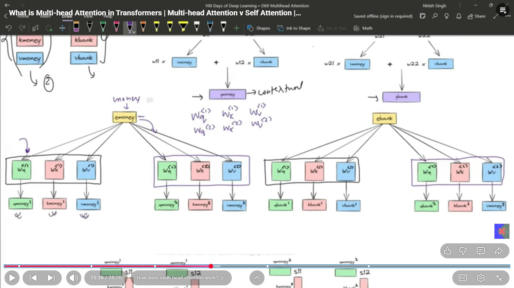
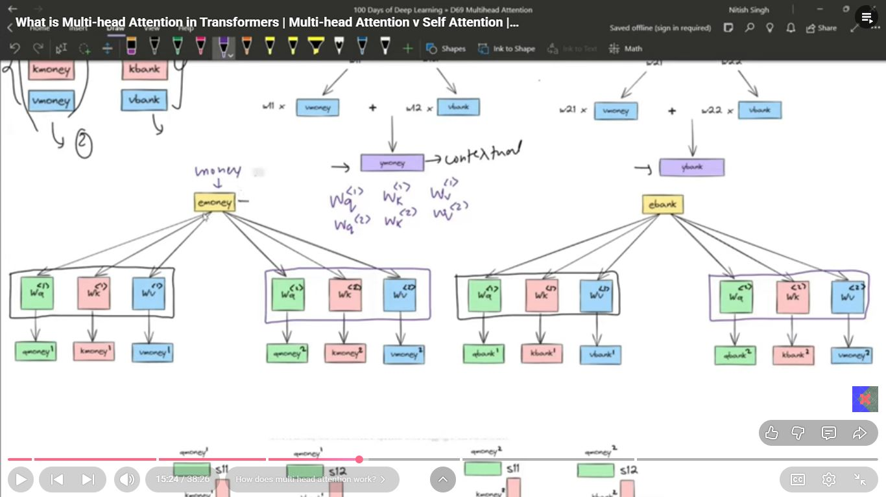
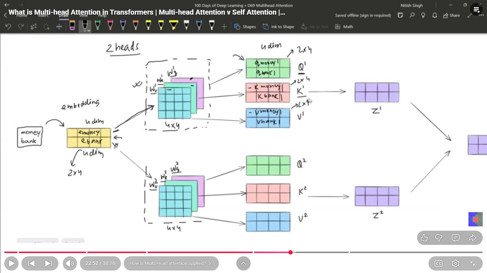
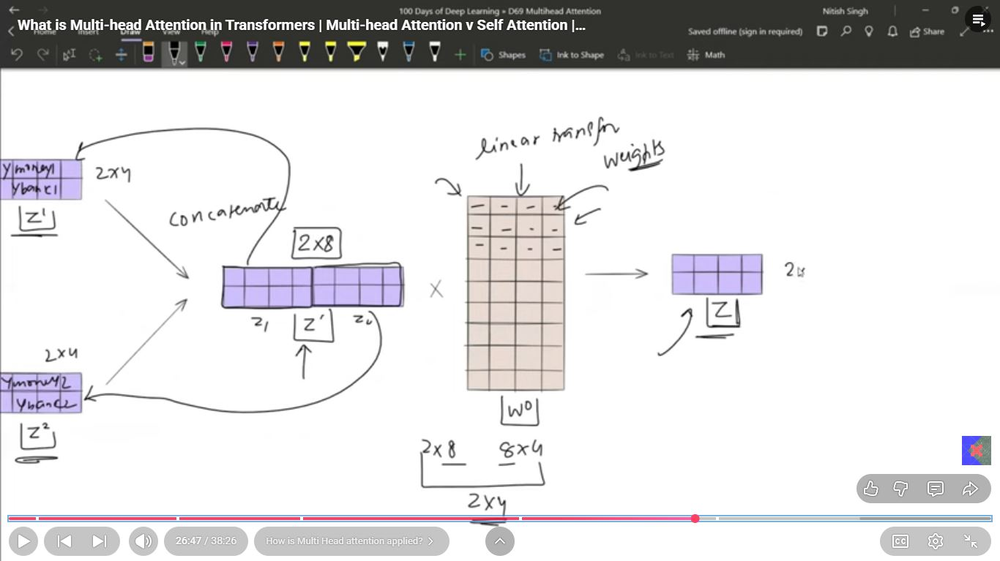
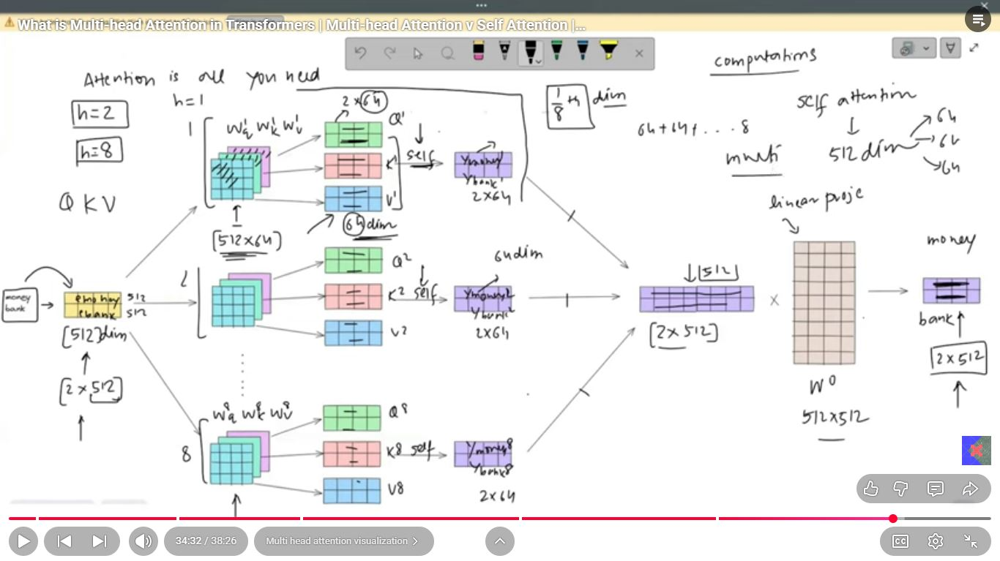

# Day_077 | 💡 Multi-Head Attention in Transformers

**Multi-Head Attention** is an enhancement of the basic **Self-Attention** mechanism. It is the core operational unit in both the **Encoder** and **Decoder** stacks of the Transformer architecture.

Its primary purpose is to allow the model to capture **different types of relationships** and attend to information from **different representation subspaces** simultaneously.

---

## 🏗️ What is Multi-Head Attention?

Multi-Head Attention works by running the basic Self-Attention calculation **multiple times in parallel** (using $h$ different "heads").

### The Process

1.  **Splitting the Input:** The Query ($\mathbf{Q}$), Key ($\mathbf{K}$), and Value ($\mathbf{V}$) matrices are not processed once. Instead, they are linearly projected $h$ different times with $h$ separate, learned weight matrices ($\mathbf{W}_{Q,i}, \mathbf{W}_{K,i}, \mathbf{W}_{V,i}$ for $i=1$ to $h$).
2.  **Parallel Attention:** Each of the $h$ resulting $\mathbf{Q}_i, \mathbf{K}_i, \mathbf{V}_i$ sets is fed into an independent Scaled Dot-Product Attention function. This produces $h$ different output matrices, $\mathbf{Z}_1, \mathbf{Z}_2, \dots, \mathbf{Z}_h$.
3.  **Concatenation:** The $h$ output matrices are concatenated back together.
4.  **Final Projection:** The concatenated result is then passed through one final linear layer ($\mathbf{W}_O$) to transform the combined information back into the desired output dimension.

$$\text{MultiHead}(\mathbf{Q}, \mathbf{K}, \mathbf{V}) = \text{Concat}(\mathbf{Z}_1, \dots, \mathbf{Z}_h) \mathbf{W}_O$$

Where $\mathbf{Z}_i = \text{Attention}(\mathbf{Q}_i, \mathbf{K}_i, \mathbf{V}_i)$.

---

## 🧠 Why We Need Multiple Heads

Using multiple attention heads offers two significant advantages:

### 1. Representation Subspaces

By using $h$ different, independently learned linear projections ($\mathbf{W}_Q, \mathbf{W}_K, \mathbf{W}_V$), each head effectively maps the input embeddings into a **different representation subspace**.

* This is crucial because a single attention mechanism might struggle to focus on all relevant aspects of the data. For example, one head might be highly effective at capturing grammatical (syntactic) relationships, while another head specializes in resolving word ambiguity (semantic relationships).

### 2. Diverse Focus

Multi-Head Attention allows the model to attend to multiple positions simultaneously.

* **Example:** In the sentence "The **animal** didn't cross the road because **it** was too wide," when processing "**it**":
    * **Head 1** might focus on the nearest subject, "**animal**," to understand the pronoun's *type* (animate).
    * **Head 2** might focus on the predicate "**too wide**" to understand the pronoun's *reason* for not crossing (confirming "it" refers to the **road**).

By combining the outputs of these specialized heads, the final output embedding for "**it**" is far richer and more nuanced than what a single attention mechanism could achieve.

---

## 🆚 Multi-Head Attention vs. Self-Attention

The relationship is one of **enhancement**, not opposition. Multi-Head Attention **is** a form of Self-Attention when applied within the same sequence (Encoder/Decoder).

| Feature | Self-Attention (Basic Unit) | Multi-Head Attention |
| :--- | :--- | :--- |
| **Number of Processes**| Single calculation. | $h$ parallel calculations. |
| **Q, K, V Matrices** | Derived using one set of $\mathbf{W}_Q, \mathbf{W}_K, \mathbf{W}_V$. | Derived using $h$ separate sets of $\mathbf{W}_{Q,i}, \mathbf{W}_{K,i}, \mathbf{W}_{V,i}$. |
| **Focus** | One single focus/perspective. | Multiple, specialized focuses/perspectives. |
| **Result** | One contextualized output $\mathbf{Z}$. | $h$ contextualized outputs $\mathbf{Z}_i$ combined into one final output. |
| **Role in Transformer**| The underlying formula used by each head. | The complete, high-capacity mechanism used in the layers. |

---

## 🎯 **1. What is Multi-Head Attention? (Definition)**

**Multi-Head Attention = several self-attention mechanisms running in parallel**, each with its own learned projections.

Instead of computing a single attention pattern, the model computes **H different attention “heads”**, each looking at the sequence in a different way.

Mathematically:

For each head ( h ):

$$
Q_h = X W^Q_h,\quad
K_h = X W^K_h,\quad
V_h = X W^V_h
$$

Each head gets its own parameter matrices.

Each head performs:

$$
\text{Attention}(Q_h, K_h, V_h)
= \text{softmax}\left(\frac{Q_h K_h^T}{\sqrt{d_k}}\right) V_h
$$

Then all heads are **concatenated** and linearly mixed:

$$
\text{MHA}(X) = \text{Concat}(head_1, \ldots, head_H) W^O
$$

---

## 🔍 **2. Intuition: Why do we need multiple heads?**

**One head can only learn *one* type of relation at a time.**
Multiple heads let the model learn **multiple perspectives** on the same sequence.

Examples of relations different heads may learn:

* Syntax / dependency structure
* Coreference (“he” → “the man”)
* Long-range context
* Local word order
* Named entity patterns
* Punctuation / boundary detection

In short:

> **One head = one lens.
> Multi-head = multiple lenses analyzing the same sentence.**

---

## 🧠 **3. Geometric Intuition**

Each head is effectively:

* a **different projection** of the token vectors,
* looking at them in a **different subspace**.

Imagine a cloud of points in high-dimensional space:

* Head 1 rotates this cloud and detects syntactic relationships.
* Head 2 rotates it differently and detects semantic similarities.
* Head 3 focuses on positional relationships.
* …

Each head performs self-attention inside its own rotated space.

This is why multi-head attention is powerful.

---

## 🆚 **4. Multi-Head Attention vs Self-Attention**

You can think of them as **different levels** of the mechanism:

---

## **✔ Self-Attention = The mechanism itself**

* Uses Q, K, V from the **same sequence** (hence “self”)
* Computes attention weights between all token pairs
* Produces one contextual embedding per token

---

## **✔ Multi-Head Attention = Multiple self-attention modules stacked in parallel**

* Each head = *a separate self-attention computation*
* Their outputs are concatenated
* Final linear layer mixes them

**Self-Attention is a building block;
Multi-Head Attention is the final structure used in Transformers.**

---

## 📌 **Key Differences (Table)**

| Concept               | Self-Attention               | Multi-Head Attention                                 |
| --------------------- | ---------------------------- | ---------------------------------------------------- |
| What it is            | A single attention mechanism | Several self-attention heads run in parallel         |
| Parameters            | One set of Q,K,V projections | Multiple sets (one per head)                         |
| Representation power  | Limited                      | Can capture many relationship types                  |
| Output                | Single attention output      | Concatenated multi-view output                       |
| Used by transformers? | Internally                   | Yes — the standard transformer block uses multi-head |

---

## 📐 **5. Example: Why multiple heads matter**

Suppose the sentence is:

> “The girl who sat near the window smiled.”

Single-head attention might only capture:

* “girl” ↔ “smiled” (subject → verb)

Other relations are lost.

Multi-head attention lets you capture:

* Head 1: subject ↔ verb
* Head 2: “who” ↔ “girl” (coreference)
* Head 3: “near” ↔ “window” (prepositional relation)
* Head 4: “sat” ↔ “near” (local adjacency)

This is why Transformers outperform RNNs:
they capture **multiple dependency structures simultaneously**.

---

## 🧩 **6. Final Summary (Quick Lecture Slide)**

### **Self-Attention**

* One mechanism
* Computes token-to-token interactions
* Q, K, V from same sequence

### **Multi-Head Attention**

* Many self-attention mechanisms in parallel
* Each with its own learned subspace
* Produces richer, multi-perspective contextual embeddings
* Standard component in every Transformer block

---

## Images

