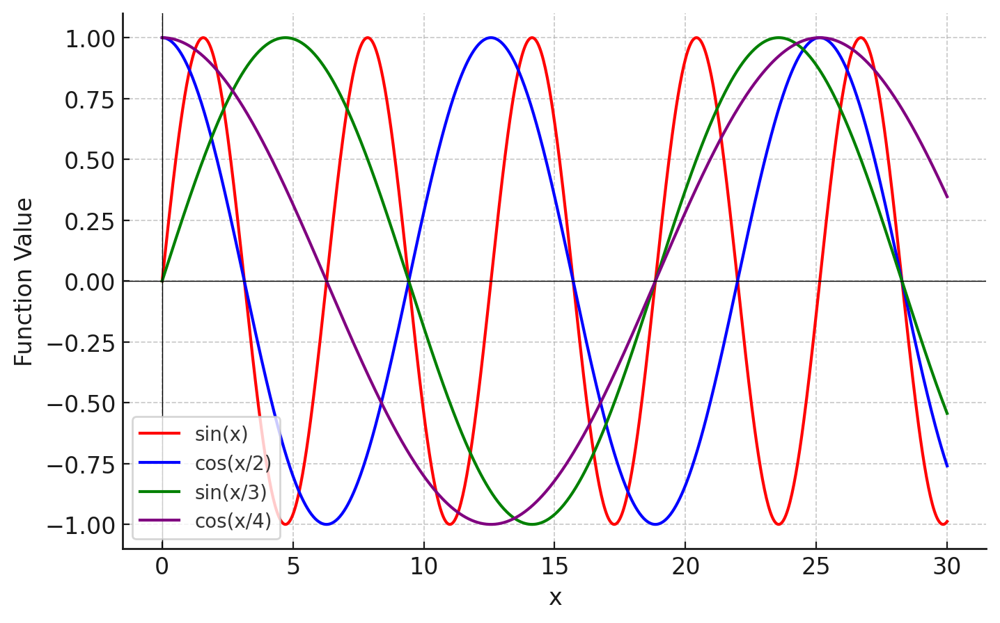
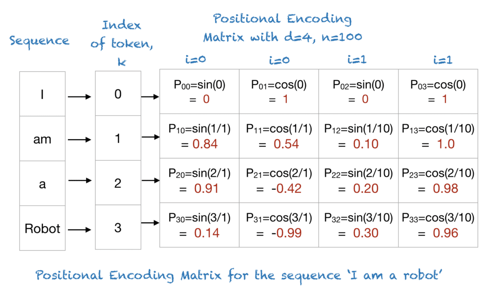
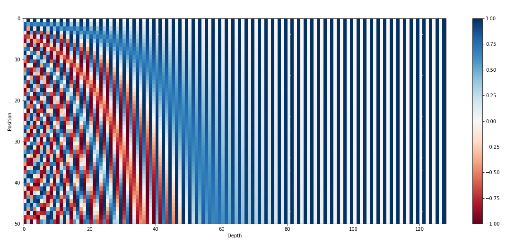

# Day_078 | 🧭 Positional Encoding in Transformers

**Positional Encoding (PE)** is a critical component of the Transformer architecture. Since the Transformer uses **Self-Attention** and no recurrence or convolution, it has no inherent way of knowing the **order** or **position** of words in a sequence. PE is the mechanism used to inject this crucial sequential information into the model.

---

## 1. The Problem: The Stateless Transformer

### First Principle: Discrete Indexing

Imagine we start by trying to inject position using simple, unique **discrete values** (a standard one-hot encoding or a simple integer index).

| Word | Index | Initial Embedding | Problem |
| :--- | :--- | :--- | :--- |
| The | 1 | $\mathbf{E}_1$ | **Large Magnitude:** Indices are unbounded. A sentence of length 10 has index 10, a length 100 has index 100. The model would see wildly different scales for the same word depending on where it appeared. |
| quick | 2 | $\mathbf{E}_2$ | **Lack of Generalization:** The model would struggle to generalize to sequences longer than those seen in training. It never saw an index 101, so it wouldn't know how to handle it. |
| brown | 3 | $\mathbf{E}_3$ | **No Semantic Meaning:** The difference between index 2 and 3 has no relationship to the difference between 98 and 99. The space isn't meaningful. |

The solution must be a technique that can represent position uniquely, scale regardless of sequence length, and allow the model to easily learn relative positions.

---

## 2. The Solution: Sine and Cosine Functions

The standard Transformer paper uses **sine and cosine functions** of varying frequencies to create the positional codes. This choice is deliberate because these functions allow the model to learn **relative position** (the key requirement).

### The Requirement: Relative Position

For the Transformer to be effective, the model must be able to compute a linear function of the position vector for position $p+k$ based on the position vector for position $p$, for any offset $k$.

Using sinusoidal functions makes this easy due to the trigonometric identity:
$$\sin(A+B) = \sin(A)\cos(B) + \cos(A)\sin(B)$$
$$\cos(A+B) = \cos(A)\cos(B) - \sin(A)\sin(B)$$

This means the encoding for position $p+k$ is a **linear function** of the encoding for position $p$. The model can thus learn the relationship between any two positions $p$ and $p+k$ by simply learning this linear transformation.

### Why 1 Sine/Cosine is Not Enough

If we used only **one sine function** (e.g., $\sin(p)$), every position $p$ would be uniquely encoded, but the range of values is limited to $[-1, 1]$. More importantly, the function is **periodic**.
$$\sin(p) = \sin(p + 2\pi k)$$
The model would confuse position $p$ with position $p+2\pi k$, leading to ambiguity.

### Why Sine and Cosine Pairs are Used

By using **pairs** of sine and cosine functions, we use $d_{\text{model}} / 2$ pairs, where $d_{\text{model}}$ is the embedding dimension. Each pair uses a different, fixed, exponentially decreasing frequency.

* **Unique Encoding:** Combining different frequencies creates a **unique binary code** for every position $p$. No two positions share the exact same combination across all $d_{\text{model}}$ dimensions.
* **Dimensionality:** This ensures the positional encoding ($\mathbf{PE}$) has the exact same dimension as the word embedding ($\mathbf{E}$), allowing them to be added element-wise.

---

## 3. The Final Formulation (Classical Approach)

The positional encoding vector $\mathbf{PE}$ for position $p$ (word index) and dimension $i$ (index within the embedding vector) is calculated as:

$$
\mathbf{PE}_{(p, 2i)} = \sin\left(\frac{p}{10000^{2i / d_{\text{model}}}}\right)
$$

$$
\mathbf{PE}_{(p, 2i+1)} = \cos\left(\frac{p}{10000^{2i / d_{\text{model}}}}\right)
$$

* **$p$ (Position):** Ranges from $0$ to $N-1$ (sequence length).
* **$i$ (Dimension):** Ranges from $0$ to $\lfloor d_{\text{model}}/2 \rfloor - 1$.
* **$d_{\text{model}}$:** The embedding dimension (e.g., 512).
* **$10000^{2i/d_{\text{model}}}$:** This is the scaling factor that determines the wavelength (frequency). For small $i$, the wavelength is very long (slow frequency), and for large $i$, the wavelength is very short (high frequency).

### Final Embedding

The input to the Transformer layers is the sum of the token embedding and the positional encoding:

$$\text{Input} = \mathbf{E}_{\text{word}} + \mathbf{PE}$$

## 4. Modern Approaches (Absolute vs. Relative)

While the sine/cosine PE works, the trend in modern LLMs has shifted toward focusing on **Relative Positional Encoding (RPE)**.

| Approach | Description | Advantages |
| :--- | :--- | :--- |
| **Absolute PE** | The classic sine/cosine method. The position is fixed and added to the input embedding. | Simple, requires no training, effective for shorter sequences. |
| **Learned Absolute PE** | Position embeddings are initialized randomly and **learned** during training. (Used by initial BERT/GPT models). | Potentially more expressive, but struggles to generalize beyond the maximum training length. |
| **Relative PE (RPE)** | Positional information is injected directly into the **Self-Attention score calculation**. The model only sees the *distance* or *relationship* between tokens ($|j-i|$), not their absolute position. | **Crucially improves generalization** to longer sequences (used by models like XLNet and T5). |
| **RoPE (Rotary Positional Embedding)** | A modern RPE variant (used by Llama/Mistral) that encodes relative position by rotating the Q and K vectors before the dot product. | Efficiently integrates position information into the attention mechanism, offering state-of-the-art performance for large models. |

---

## 1) First principles — why do we need positional encoding?

Transformers use self-attention. Self-attention computes pairwise interactions between tokens in a set-like way:

$$
\text{Attention}(Q,K,V) = \operatorname{softmax}\left(\frac{QK^\top}{\sqrt{d_k}}\right) V
$$

Attention is permutation-equivariant: if you permute input tokens (and the same permutation on queries/keys/values), the attention computation does not inherently depend on the *order* of tokens. But language (and most sequences) is ordered: “dog bites man” ≠ “man bites dog”.

Therefore we must inject **position information** into token representations so attention can use order. The question is: **how** to inject positional information so that:

* The model knows absolute/relative order when needed.
* The representation is learnable/useful.
* We generalize (possibly to longer sequences), and remain computationally stable.

---

## 2) Naive approach: mark a unique discrete integer for each word

A naive idea: for token at index `pos`, append a scalar equal to `pos` (or one-hot of position). Problems:

* **Scale & range**: `pos` grows unbounded; raw integer values are not scale-invariant.
* **Embedding coupling**: token embedding and position scalar might be on different scales; model must learn to combine them.
* **Discrete one-hot positional vectors**: if you have fixed maximum length `L`, you could provide one-hot position vectors. Problems:

  * Memory: one-hot is length `L`.
  * **No extrapolation** beyond `L`.
  * Does not encode useful structure like distance or relative order in a compact way.

So we need better encodings: compact, continuous, and ideally allow the model to learn relative/absolute relationships.

---

## 3) The sinusoidal positional encoding (Vaswani et al., "Attention Is All You Need")

Classic solution: for position `pos` and dimension index `i` (0-based),

$$
\begin{aligned}
\text{PE}*{pos,2i} &= \sin\left(\frac{pos}{10000^{2i/d}}\right) \
\text{PE}*{pos,2i+1} &= \cos\left(\frac{pos}{10000^{2i/d}}\right)
\end{aligned}
$$

where `d` is the model dimension.

**Why this form?**

* Uses many frequencies (periods) across dimensions: low-frequency dims vary slowly with `pos`, high-frequency dims vary fast.
* The combination of sines and cosines at different frequencies creates a unique encoding for each `pos` (for a reasonable range).
* **Relative information**: because sinusoids can be expressed using linear combinations and trig identities, the model can (in principle) learn to compute relative offsets using linear operations. For example, shifting `pos` causes predictable phase shifts across frequencies.

**How used**: Typically `PE_pos` is **added** to token embedding `E(token)`:

$$
x_{pos} = E(token_{pos}) + PE_{pos}
$$

(Alternatives include concatenation or conditioned injection; addition is most common.)

---

## 4) What if I use only one sine? (one sine and maybe one cosine pair)

Suppose you use a single pair (single frequency): `sin(ω pos)` and `cos(ω pos)` only.

**Problems / behaviors:**

* **Aliasing & non-uniqueness**: Single frequency is periodic with period `T = 2π/ω`. All positions that differ by multiples of `T` will have identical encodings. So you lose uniqueness across positions larger than the period.
* **Limited representational power**: only one dimension of variation (phase). The model cannot distinguish many distinct relative distances.
* **No multi-scale structure**: language has both local and long-range dependencies; a single frequency cannot represent both well.

If you use multiple dimension pairs but all with the same frequency, same problems — you need multiple frequencies to encode multiple scales.

**Takeaway**: a single sine/cosine pair only encodes circular phase at one scale — it's too limited for real sequences (unless you are intentionally modeling a strictly periodic domain with known short period).

---

## 5) Why multiple frequency pairs (the Vaswani design) helps

Multiple frequencies (geometric progression of wavelengths) give:

* **Multi-scale representation**: short wavelengths capture local position differences; long wavelengths encode coarse position structure.
* **Uniqueness**: combination of many frequencies yields near-unique vector per position over a long range.
* **Linearity for relative offsets**: trig identities (e.g. sin(a+b)) allow relative position effects to be represented by linear transforms in the embedded space (subject to how model uses them). This helps attention heads to infer relative distances.

Concretely, consider the vector of cos/sin across frequencies: shifting `pos` by `k` multiplies/rotates each frequency's phase in a predictable way. If you set up queries and keys to produce dot-products that are sensitive to phase differences, attention can prefer tokens at certain offsets.

---

## 6) Absolute vs Relative positional encodings

* **Absolute positional encodings**: provide each position with an encoding independent of other tokens (sinusoidal or learned). Works well in many settings.

  * Pros: simple, efficient, allows positional-specific behavior.
  * Cons: hard to generalize beyond training lengths (unless sinusoidal), and encoding focuses on absolute position more than pairwise distances.

* **Relative positional encodings**: encode the *relative distance* between tokens into the attention computation itself. Instead of adding PE to embeddings, they modify attention scores or transform keys/queries.

Relative methods often improve performance on tasks where relative distance matters (e.g., language modeling) and help with generalization to longer contexts.

---

## 7) Notable relative/modern approaches — overview & intuition

I'll list the main approaches used in modern transformer literature, with intuition, equations, and pros/cons.

---

### 7.1 Learned absolute positional embeddings

* Each position `pos` has a learnable vector `P[pos]` of size `d`.
* Added to token embedding: `x_pos = E(token) + P[pos]`.

Pros:

* Flexible—model learns optimal pos encodings for the task.
* Often performs better on in-domain lengths.

Cons:

* No natural generalization beyond max length `L` used in training.
* Memory cost for large `L`.

Use when: sequence lengths fixed or bounded, and you care about in-domain performance.

---

### 7.2 Sinusoidal (fixed) positional encodings

Explained earlier. Pros: no learned parameters, extrapolates to unseen lengths (to some extent), simple.

Cons: sometimes underperforms learned encodings when tasks rely on absolute position distributions seen in training.

Use when: need extrapolation and simplicity.

---

### 7.3 Relative positional encodings (Shaw et al., Transformer-XL style)

Two main variants:

#### (a) Shaw et al. (relative keys/values)

Modify attention weights by adding a learned embedding indexed by relative distance `r = j - i`:

$$
\text{score}(i,j) = Q_i K_j^\top + Q_i R_{i-j}^\top
$$

Where `R_{r}` is a learned vector for relative distance `r`. Or add relative term to values.

Pros:

* Directly encodes pairwise distance in attention logits.
* Good for language modeling and tasks where relative positions matter.

Cons:

* Requires clipping of large distances and memory for relative tables.
* Implementation slightly more complex.

#### (b) Transformer-XL's segment-level recurrence and relative bias

Transformer-XL re-parameterized the attention to factor in relative offsets enabling longer-context recurrence. It uses learnable content and positional biases so that attention depends on relative distance rather than absolute position.

---

### 7.4 T5 / Raffel et al. — relative attention via **relative position bias**

T5 introduced **relative position bias**: a small learned scalar bias `b_{r}` per attention head for each relative distance `r`. The attention logits become:

$$
\text{score}(i,j) = \frac{Q_i K_j^\top}{\sqrt{d}} + b_{h}(j-i)
$$

(`b_h` is per-head bias table). This is simple, parameter-efficient, and easy to implement.

Pros:

* Very effective and stable.
* Cheap in memory (scalars per relative distance per head).
* Works well for encoder/decoder.

Cons:

* Still needs clipping for large distances and doesn't produce a vector that can be used elsewhere (just a bias).

---

### 7.5 RoPE — Rotary Positional Embeddings (Su et al., later used in GPT-NeoX / others)

**Intuition:** Instead of adding position vectors, *rotate* query and key vectors in the complex plane per frequency according to position. This makes the dot product between Q and K include relative phase information naturally.

Mathematically, for each frequency pair (2 dimensions) we apply a rotation matrix `R(pos)` to the pair of components in `Q` and `K`. Then:

$$
\text{score}(i,j) \propto (R(pos_i) Q_i)^\top (R(pos_j) K_j) = Q_i^\top R(pos_i)^\top R(pos_j) K_j
$$

Because `R(pos_i)^\top R(pos_j)` depends on `pos_j - pos_i`, relative position appears multiplicatively.

Pros:

* Naturally encodes relative positions in dot product.
* Works with rotary matrix math; no extra parameters except possibly frequency schedule.
* Empirically good for long-range generalization and extrapolation to longer sequences.

Cons:

* Slightly more complex math and implementation (but many libraries now support it).
* How to pick frequencies affects properties.

---

### 7.6 ALiBi — Attention with Linear Biases (Press et al.)

**Idea:** Add a linear bias to the attention logits that increases with distance: `bias = -slope * (j - i)` for each head, with head-specific slope. That is, further tokens get penalized linearly.

$$
\text{score}(i,j) = \frac{Q_i K_j^\top}{\sqrt{d}} + \text{bias}_{h}(j-i)
$$

Where `bias_h(r) = -\alpha_h \cdot r` (for r≥0). No learned table per position — only per-head slopes. This method showed good extrapolation to longer sequences.

Pros:

* Extremely simple, parameter-efficient.
* Works well for scaling & extrapolation; easy to implement.

Cons:

* Encodes only monotonic decay by distance; doesn't encode richer relative patterns.
* Not suitable where fine-grained relative position structure is needed.

---

### 7.7 Attention with Gaussian / kernelized position encodings, and other variants

There are many other designs: Gaussian RBFs, learned continuous positional functions, relative bucketing (T5 uses bucketing/clipping), multi-headed relative biases, etc. They trade off parameter cost, generalization, and expressivity.

---

## 8) How these methods interact with attention mathematically — short derivations

### 8.1 Additive positional encoding (absolute)

If `x_i = E(token_i) + P[pos_i]`, then

$$
Q_i = W^Q x_i = W^Q E_i + W^Q P_i
$$

$$
K_j = W^K E_j + W^K P_j
$$

Dot product includes cross-terms:

$$
Q_i \cdot K_j = (W^Q E_i)\cdot(W^K E_j) + (W^Q E_i)\cdot(W^K P_j) + (W^Q P_i)\cdot(W^K E_j) + (W^Q P_i)\cdot(W^K P_j)
$$

Thus attention can (in principle) use absolute or relative positional cues via cross-terms. But nothing enforces dependence only on `j-i`.

### 8.2 Rotary (RoPE) — relative dependence emerges naturally

RoPE rotates the `Q` and `K` by position-dependent orthonormal matrices. The dot product becomes dependent on `R(pos_i)^\top R(pos_j)` which depends only on `(pos_j - pos_i)` for simple rotation parametrizations. So relative position is naturally encoded in the score without extra learned tables.

---

## 9) Practical implementation examples (PyTorch-like pseudocode)

### 9.1 Sinusoidal PE (numpy / PyTorch-like)

```python
import numpy as np

def sinusoidal_positional_encoding(max_len, d_model):
    pe = np.zeros((max_len, d_model))
    position = np.arange(0, max_len)[:, None]
    div_term = np.exp(np.arange(0, d_model, 2) * -(np.log(10000.0) / d_model))
    pe[:, 0::2] = np.sin(position * div_term)
    pe[:, 1::2] = np.cos(position * div_term)
    return pe  # shape (max_len, d_model)
```

### 9.2 RoPE concept (per head, per pair of dims)

Sketch: for each pair of dimensions (2k, 2k+1) treat them as a complex number and rotate by angle `θ_k * pos`.

```python
# conceptual
theta = 1.0 / (10000 ** (2*k / d))
angle = pos * theta
# rotate pair (x_2k, x_2k+1) by matrix [[cos, -sin],[sin, cos]]
```

Many libraries implement RoPE efficiently by precomputing rotation matrices or using clever tensor ops.

### 9.3 Relative bias in T5 style (logits bias)

```python
# b is a table of shape (num_heads, max_rel_distance)
# logits is QK^T / sqrt(d)
# add per-head bias (with clipping/bucketing for r outside)
logits = torch.matmul(Q, K.transpose(-2,-1)) / math.sqrt(d)
rel_idx = clip_and_bucket(j - i)
logits = logits + b[:, rel_idx]  # broadcasting over tokens
```

---

## 10) Comparison table (short)

| Method             |                        Injects |               Params |   Extrapolate |       Complexity | When to use                |
| ------------------ | -----------------------------: | -------------------: | ------------: | ---------------: | -------------------------- |
| Sinusoidal         |               Absolute (fixed) |                    0 |          Good |     O(1) per pos | Need extrapolation; simple |
| Learned absolute   |             Absolute (learned) |               O(L·d) | Poor beyond L |           Simple | In-domain tasks            |
| Relative bias (T5) |         Relative (scalar bias) |               O(H·R) |      Moderate |    Simple to add | Efficient relative info    |
| Shaw-style rel     |        Relative (vector terms) |               O(R·d) |      Moderate |     More complex | LM / recurrence setups     |
| Transformer-XL     |        Relative via recurrency |       Param moderate |          Good |          Complex | Long context LM            |
| RoPE               | Implicit relative via rotation | 0 (or freq schedule) |          Good | Slightly complex | Extrapolation and LM       |
| ALiBi              |           Linear distance bias |           Very small |     Excellent |      Very simple | Scaling to long contexts   |

Notes: `L` = max length, `d` = dimension, `H` = heads, `R` = relative range table size.

---

## 11) Which to choose? practical guidance

* If you need **strong in-domain performance** and training lengths are bounded: *learned absolute embeddings* often work well.
* If you need **extrapolation** to longer sequences than trained on: *sinusoidal*, *RoPE*, or *ALiBi* are good choices (ALiBi and RoPE are commonly used in large LMs for length generalization).
* If **relative distances matter** (e.g., attention should depend primarily on distance): *relative biases* (T5-style), Shaw-style relative embeddings, or RoPE are useful.
* If you want **simplicity and parameter-efficiency**: ALiBi or T5 relative bias.
* If you want to **encode rich pairwise functions**: Shaw-style relative vectors or learnable relative meta-functions.

---

## 12) Deeper intuitions / how models use positional encodings

* **Attention heads can learn roles**: Some heads learn to attend locally (short relative distances), some globally (long-range). Multi-frequency encodings let different heads pick frequencies that suit their roles.
* **Relative vs absolute control**: Absolute PEs can tell "this is start-of-sequence" explicitly; relative PEs emphasize relationships like "this token is 3 tokens to the left".
* **Phase & dot-products**: In sinusoidal/RoPE, dot-products between Q and K approximately encode cos(ω*(pos_j-pos_i)) across frequencies; model can combine frequencies to approximate indicator functions over distances.
* **Extrapolation mechanism**: Sinusoids and rotations are deterministic functions of `pos`, so when `pos` goes beyond training range the pattern continues; learned absolute embeddings do not have this property (unless you design continuous parametrization).

---

## 13\) Limitations and open issues

* **Position beyond training horizon**: Learned absolute embeddings fail; many modern LMs use RoPE/ALiBi for better extrapolation.
* **Long-range modeling**: Encoding positional info is necessary but not sufficient—attention sparsity, memory/compression (Longformer, BigBird, etc.) are also needed.
* **Interpretability**: It's not always clear how the model uses the positional encodings (absolute vs relative). RoPE biases toward relative usage but still learned weights decide.
* **Choice of frequency schedule**: For sinusoidal/RoPE, the schedule (e.g., geometric progression base 10000) matters; alternative scalings can change behavior.
* **Non-linear injection**: Adding PEs is simple but not the only way; gating, concatenation, or conditioning queries/keys differently can sometimes help.

---

## 14) Concrete example: why multiple frequencies let you represent relative shift

Consider two frequencies `ω1` and `ω2`. For each frequency, the pair `(cos(ω pos), sin(ω pos))` is a 2D vector representing phase. A shift by `k` becomes `(cos(ω (pos+k)), sin(ω (pos+k)))` — a rotation of the phase vector.

If you have many such vectors at different ω, the set of phase rotations across frequencies uniquely identify `k` (modulo periodicities), and linear combinations of these can approximate a delta/indicator of a particular shift. Hence the attention mechanism can learn to select tokens at a specific relative offset by combining head outputs tuned to different frequencies.

---

## 15) Implementation gotchas & tips

* **Scaling**: When adding PE to embeddings, ensure magnitudes are compatible (scale embeddings or PEs so neither dominates).
* **LayerNorm & residuals**: Typically position-added embeddings go into the stack as usual; LayerNorm may interact with PEs—no special handling usually needed.
* **Clipping/bucketing**: For relative bias tables, clip or bucket large distances to limit table size.
* **Compatibility**: RoPE expects query and key to be split into even pairs of dims (or supporting code to handle odd dims).
* **Multi-GPU / sharding**: Learned large `L` tables can be memory heavy; use relative bias or ALiBi to save memory.

---

## 16) Quick cheat-sheet (summary)

* **Need**: Transformers are permutation-invariant — positional information must be injected.
* **Simple choices**:

  * `Add learned P[pos]` — easy, powerful but no extrapolation.
  * `Add sinusoidal PE` — parameter-free, extrapolates, multi-scale.
* **Better for relative tasks**:

  * `Relative bias` (T5) — cheap and effective.
  * `Shaw-style` — vector-based relative embeddings.
  * `RoPE` — rotates Q/K to encode relative offsets naturally.
  * `ALiBi` — linear distance bias for easy extrapolation.
* **Single sine**: insufficient — periodic and ambiguous. Use many frequencies.

---

## 17) Short code snippet — sinusoidal + attention (PyTorch-style pseudocode)

```python
# assume embeddings: x (batch, seq_len, d)
pe = sinusoidal_positional_encoding(max_len=seq_len, d_model=d)  # (seq_len, d)
x = x + pe[None, :seq_len, :]  # add

# standard multihead attention follows...
```

For RoPE, you'd apply rotation before computing Q and K dot-product; for ALiBi or T5-bias add scalar biases to logits.

---

## 18) Final practical recommendations

* If you're building a new model for general LM or tasks requiring long contexts: **use RoPE or ALiBi** (or both variants explored in the literature). They are simple and scale well.
* If you train on a fixed max-length dataset and want maximal performance there: **learned positional embeddings** often produce best in-distribution results.
* If you need interpretable relative distances or per-head control: **relative biases** (T5-style) or Shaw-style relative encodings are good.
* **Don’t use a single sine/cosine pair**—it’s too limited.

---


## References
[blog.timodenk.com](https://blog.timodenk.com/linear-relationships-in-the-transformers-positional-encoding/)

## Images


