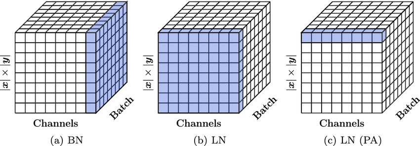
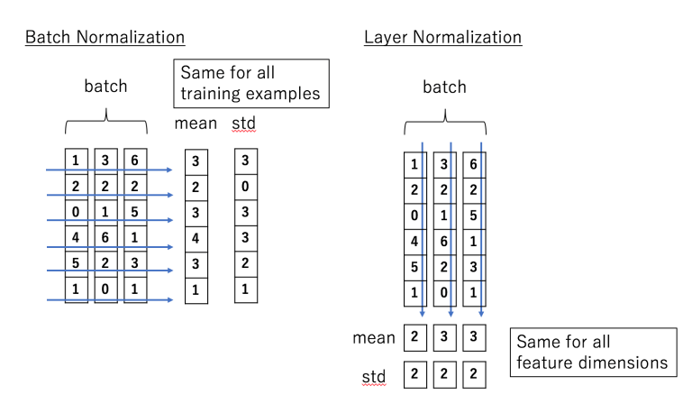

# Day_079 | ⚖️ Layer Normalization in Transformers

**Layer Normalization (Layer Norm)** is a normalization technique applied to the activations of deep neural networks. It is crucial in the Transformer architecture because it provides **training stability** and helps mitigate the problems associated with unstable gradients and varying input distributions.

It differs significantly from **Batch Normalization (Batch Norm)** in where the statistics (mean and variance) are calculated.

---

## 🧐 How Layer Normalization Works

Layer Normalization computes the mean and variance **across the features (or hidden dimension)** within a single training sample, rather than across the samples in the entire batch.

For an activation vector $\mathbf{x}$ of dimension $D$ (where $D$ is $d_{\text{model}}$, e.g., 512), the normalized value $\hat{\mathbf{x}}$ is calculated as:

$$
\mu = \frac{1}{D} \sum_{i=1}^{D} x_i
$$

$$
\sigma^2 = \frac{1}{D} \sum_{i=1}^{D} (x_i - \mu)^2
$$

$$
\hat{x}_i = \frac{x_i - \mu}{\sqrt{\sigma^2 + \epsilon}}
$$

After normalization, the normalized output $\hat{\mathbf{x}}$ is scaled and shifted by two learned parameters, $\gamma$ (gain) and $\beta$ (bias), which allow the network to restore the necessary expressive power:

$$
y_i = \gamma \hat{x}_i + \beta
$$

* $\epsilon$ is a small constant for numerical stability.
* $\gamma$ and $\beta$ are unique to each layer but shared across all samples in the batch.

---

## 🆚 Layer Norm vs. Batch Norm

The difference between Layer Norm and Batch Norm is entirely defined by the **axis over which statistics are computed**.

| Feature | Layer Normalization | Batch Normalization |
| :--- | :--- | :--- |
| **Statistics Calculated** | **Across the feature/hidden dimension** (horizontally) within a single sample. | **Across the batch dimension** (vertically) for a single feature. |
| **Dependency** | **Independent of batch size.** The mean/variance is unique to the sample. | **Highly dependent on batch size.** Requires a large batch for accurate statistics. |
| **Applicability** | Ideal for **sequential data** (RNNs, Transformers) where sequence length varies and batch size might be small. | Ideal for **image data** (CNNs) where large, fixed-size batches are common. |
| **Inference** | Same as training; statistics calculated per sample. | Uses moving averages calculated during training (global statistics). |

## 🔑 Why Layer Norm is Essential for Transformers

Layer Normalization is critical for the Transformer architecture for two main reasons:

1.  **Sequence Length Variation:** In NLP, the sequence lengths (number of tokens) vary greatly. Layer Norm doesn't care about the sequence length; it only normalizes the feature dimension ($d_{\text{model}}$), which is constant.
2.  **Small Batch Sizes:** Due to the massive size of Transformers (many parameters) and the long sequences they often process, the **batch size is often very small** (sometimes as low as 1 or 2). Batch Normalization fails catastrophically with small batches because the mean and variance computed are highly unstable and inaccurate. Layer Norm remains stable regardless of the batch size.
3.  **Position in Transformer:** Layer Norm is typically applied **before** the Self-Attention and Feed-Forward sublayers in the Encoder and Decoder blocks. This stabilizes the input to each of these complex transformations, preventing the inputs from becoming too large and promoting faster convergence.


---

## 1️⃣ Problem: Why do we need normalization?

During training, deep networks (including Transformers) suffer from:

* unstable activations
* exploding/vanishing gradients
* sensitivity to weight initialization
* slower convergence

**Normalization** mitigates this by keeping activation statistics well-behaved.

In Transformers, normalization is especially important because:

* attention outputs vary a lot depending on sequence structure
* residual connections may accumulate large values
* multi-head projections create dimension-wise scale inconsistencies

---

## 2️⃣ What is Layer Normalization (LayerNorm)?

Given an input vector for a single token:

$$
x = [x_1, x_2, ..., x_d]
$$

LayerNorm normalizes **across the features (channels)**:

$$
\mu = \frac{1}{d}\sum_{i=1}^{d} x_i,\quad
\sigma = \sqrt{\frac{1}{d}\sum_{i=1}^{d}(x_i - \mu)^2 + \epsilon}
$$

Then:

$$
\text{LayerNorm}(x)_i = \gamma_i \cdot \frac{x_i - \mu}{\sigma} + \beta_i
$$

Where:

* `μ` and `σ` are computed **per token**
* `γ` and `β` are learnable parameters (same dimension as features)

Compute over shape:

```
(batch, seq_len, hidden_dim)
                    ↑ normalize over this dim
```

No dependence on the batch or sequence length.

---

## 3️⃣ Why Transformers Use LayerNorm (and not BatchNorm)

Transformers operate on:

* variable batch sizes
* variable sequence lengths
* autoregressive decoding (1 token at a time)

BatchNorm fails here, LayerNorm does not.

Let’s dig into why.

---

### ⭐ LayerNorm vs BatchNorm — THE KEY DIFFERENCE

| Property                                   | **LayerNorm**              | **BatchNorm**                          |
| ------------------------------------------ | -------------------------- | -------------------------------------- |
| Normalizes over                            | **features of each token** | **batch + spatial/sequence dimension** |
| Works with varying batch sizes             | ✔ Yes                      | ❌ No                                   |
| Works with variable sequence lengths       | ✔ Yes                      | ⚠ Problematic                          |
| Works in autoregressive decoding (batch=1) | ✔ Yes                      | ❌ Fails (variance=0)                   |
| Depends on batch statistics                | ❌ No                       | ✔ Yes                                  |
| Training vs inference behavior             | Same                       | Different (uses running stats)         |
| Used in Transformers                       | ✔ Yes                      | ❌ Almost never                         |

---

## 4️⃣ Why BatchNorm Fails in Transformers

### ❌ 1. Batch statistics depend on other samples

A token’s representation would vary depending on what other sequences happened to be in the batch.

This breaks **sequence invariance** and **model stability**.

---

### ❌ 2. Autoregressive generation (LLMs) breaks BatchNorm

In generation, you predict **one token at a time**, so batch size = 1.

BatchNorm variance becomes zero → division by zero → model collapses.

LayerNorm works because statistics come only from the token’s hidden dimension.

---

### ❌ 3. Sequence length variability

BatchNorm over `(batch, seq_len)` requires consistent spatial dimensions.

Transformers don’t have fixed seq_len; training and inference lengths differ.

---

### ❌ 4. RNN-like settings

BatchNorm was designed for CNNs, not sequential models with self-attention patterns.

---

## 5️⃣ Why LayerNorm Works so Well in Transformers

### ✔ Works for variable batch sizes (even batch=1)

Normalization is independent of batch.

### ✔ Works for variable sequence lengths

Normalization is done on the last dimension only.

### ✔ Same behavior in training and inference

No running statistics like BatchNorm → simpler, more stable.

### ✔ Per-token normalization fits attention patterns

Attention outputs differ per token; per-token normalization stabilizes these.

### ✔ Works with residual connections

Residual accumulation is kept in safe range.

---

## 6️⃣ Pre-LN vs Post-LN in Transformers

Original paper (2017) used **Post-LN**:

```
x = x + Dropout(Attention(LN(x)))
x = x + Dropout(MLP(LN(x)))
```

But Post-LN suffers from gradient instability for deep models.

**Modern Transformers use Pre-LN**:

```
y = x + Attention(LN(x))
z = y + MLP(LN(y))
```

Advantages:

* more stable training
* deeper models (GPT-3, PaLM, LLaMA)
* better gradient flow

---

## 7️⃣ Intuition: What is LayerNorm actually doing?

Consider a hidden vector for each token:

```
[ 3.2, -1.0, 0.5, 2.1, … ]
```

Some dimensions may explode; others may shrink.

LayerNorm forces this vector into:

* mean ≈ 0
* variance ≈ 1
* then rescales using learned γ and β

This creates:

🎯 **stable activations**
🎯 **uniform scale across features**
🎯 **even playing field for attention heads**
🎯 **consistent gradient flow**

---

## 8️⃣ Mini NumPy Implementation (very clear)

```python
import numpy as np

def layer_norm(x, eps=1e-5):
    """
    x: (..., hidden_dim)
    layernorm over hidden_dim
    """
    mean = x.mean(axis=-1, keepdims=True)
    var  = x.var(axis=-1, keepdims=True)
    return (x - mean) / np.sqrt(var + eps)
```

BatchNorm for reference:

```python
def batch_norm(x, eps=1e-5):
    """
    x: (batch, seq, hidden_dim)
    norm over (batch, seq) dimensions
    """
    mean = x.mean(axis=(0,1), keepdims=True)
    var  = x.var(axis=(0,1), keepdims=True)
    return (x - mean) / np.sqrt(var + eps)
```

Notice BatchNorm couples different samples together.

---

## 9️⃣ Summary: LayerNorm vs BatchNorm (final conclusions)

### 🚀 Transformers MUST use LayerNorm because:

* They operate token-by-token (autoregressive generation)
* They require variable batch sizes
* They require variable sequence lengths
* They must avoid batch-statistics dependence
* Self-attention is sensitive to per-token scaling

### 🔥 BatchNorm is great for CNNs

But fundamentally incompatible with Transformers.

---


## Images

