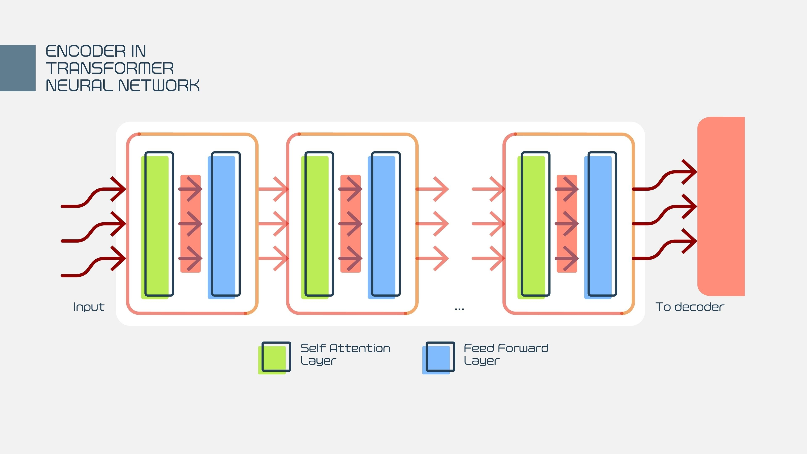
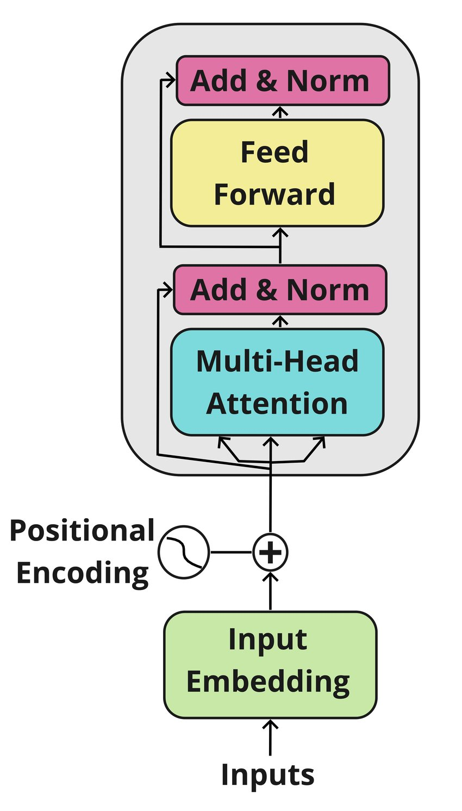
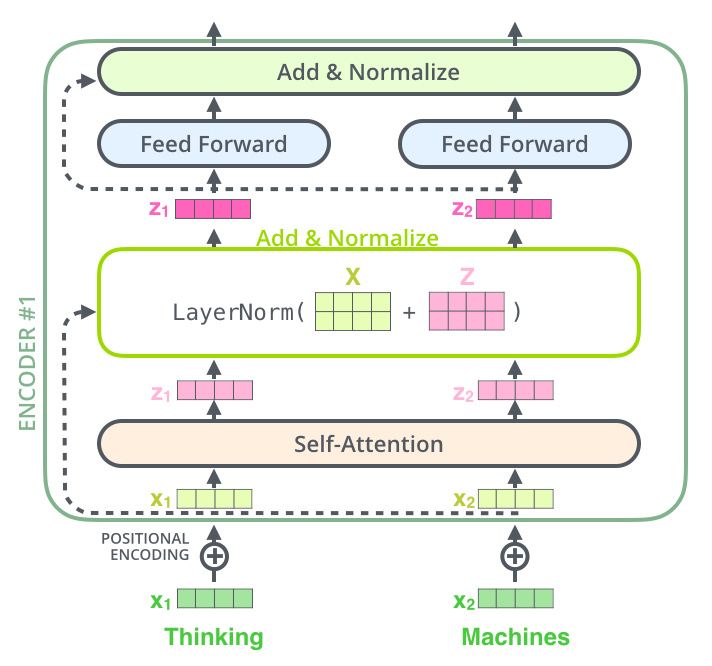
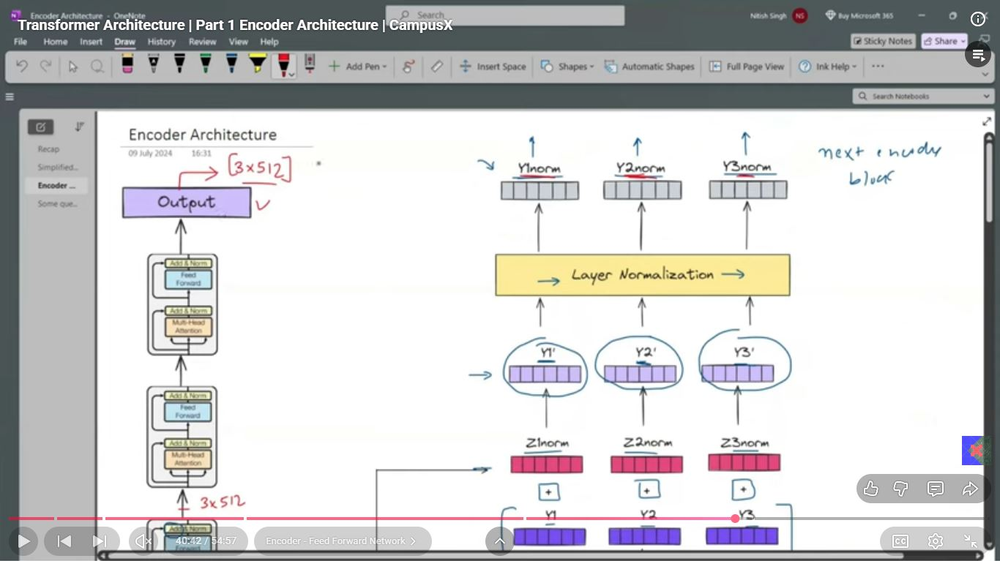
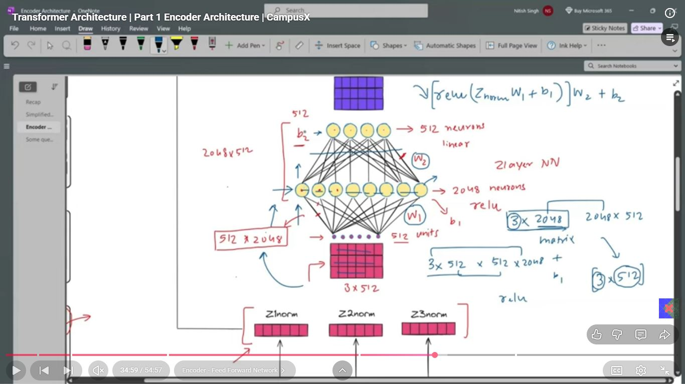
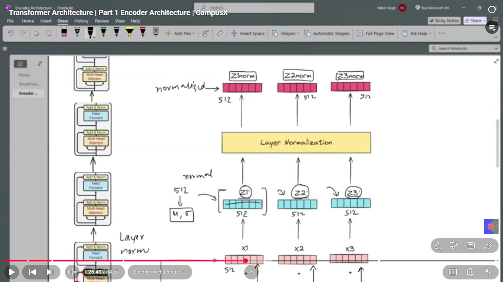
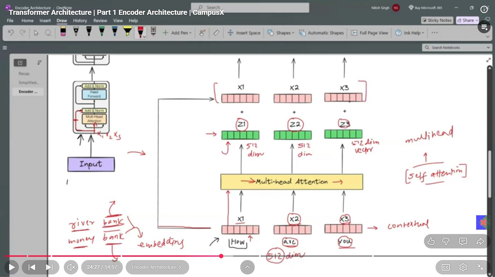

# Day_080 | ⚙️ Transformer Encoder Architecture

The **Encoder** is the first half of the Transformer's original Sequence-to-Sequence (Seq2Seq) architecture. Its primary role is to process the input sequence (e.g., the source sentence in translation) and convert it into a sequence of rich, contextualized numerical representations.

The Encoder is a stack of $N$ identical layers (often $N=6$). Each layer receives a sequence of vectors and outputs a sequence of vectors with the same dimension and length.

---

## 🏗️ Components of a Single Encoder Layer

Each Encoder Layer consists of two main sub-layers, each followed by **Layer Normalization** and a **Residual Connection**:

### 1. Multi-Head Self-Attention Sub-Layer

* **Role:** This is the core mechanism that models the relationships between all words *within* the input sequence. It computes a contextualized representation for each token by selectively weighing the importance of all other tokens in the sentence.
* **Input:** The sequence of input vectors (which are the sum of the **word embeddings** and **positional encodings**).
* **Process:** For every word, its **Query** vector is used to score all **Key** vectors to produce **Attention Weights**. These weights are then applied to the **Value** vectors to produce a weighted sum, which is the new, context-aware vector for that word.
* **Output:** A sequence of attention-weighted vectors.

### 2. Feed-Forward Network (FFN) Sub-Layer

* **Role:** This sub-layer performs complex, non-linear transformations on the output of the attention sub-layer. It is applied **independently and identically** to *every position* in the sequence.
* **Mechanism:** It is typically a simple two-layer fully connected network with a **ReLU** activation:
    $$\text{FFN}(\mathbf{x}) = \max(0, \mathbf{x} \mathbf{W}_1 + \mathbf{b}_1) \mathbf{W}_2 + \mathbf{b}_2$$
    * The inner layer often expands the dimension significantly (e.g., $d_{\text{model}} \rightarrow 4 \cdot d_{\text{model}}$), allowing the model to project the contextualized information into a higher-dimensional space for non-linear processing before projecting it back down.
* **Output:** A sequence of vectors with the same dimension as the input.

---

## 🔄 Residual Connections and Layer Normalization

For training stability and speed, two essential techniques are applied around each sub-layer:

### 1. Residual Connection

* **Placement:** The input of each sub-layer is added directly to its output.
* **Purpose:** This technique helps mitigate the **vanishing gradient problem** by creating a direct path for the gradient to flow backward, allowing the model to train deep stacks effectively.
    $$\text{Output} = \text{Input} + \text{SubLayer}(\text{Input})$$

### 2. Layer Normalization

* **Placement:** Applied immediately after the residual connection and summation.
* **Purpose:** It normalizes the activation vector **across the feature dimension** for a single sample. This stabilizes the training process by ensuring the inputs to the next layer have a consistent mean and variance, independent of the batch size.

## 📝 The Final Output of the Encoder

The input sequence of embeddings is first processed by the **Positional Encoding** and then flows through the stacked layers.

The output of the final Encoder layer is a sequence of contextualized vectors (the **Keys and Values**). This output is then passed to the **Cross-Attention** sub-layers in the Decoder, where it is used to generate the target sequence.




 The **Transformer Encoder** is the part of the Transformer architecture responsible for processing the input sequence and transforming it into a rich, contextualized numerical representation. It forms the foundation of models like **BERT**.


---

## ❓ Three Famous Questions about the Encoder

### 1. Why use Residual Connections?

Residual connections (**skip connections**) are essential for training very deep neural networks, including the Transformer:

* **Solves the Vanishing Gradient Problem:** In deep networks, gradients often shrink as they propagate backward through many layers (especially without recurrence). The residual connection creates a **direct pathway** for the gradient to flow through, bypassing non-linear transformations. This ensures that the error signal from the top layers can effectively reach and update the lower layers.
* **Improves Training Stability:** They help the model maintain the original information and only force the sub-layer (Attention or FFN) to learn a **residual function** ($\mathbf{Y} - \mathbf{X}$), which is often easier to optimize than learning the complete transformation from scratch.

### 2. Why use a Feed-Forward Neural Network (FFN)?

The FFN is a two-layer, position-wise non-linear transformation applied to every token's output independently.

$$\text{FFN}(\mathbf{x}) = \max(0, \mathbf{x} \mathbf{W}_1 + \mathbf{b}_1) \mathbf{W}_2 + \mathbf{b}_2$$

* **Introduce Non-Linearity and Capacity:** While Self-Attention captures relationships between tokens, the attention operation itself is largely linear (weighted sum). The FFN provides the necessary **non-linearity** to allow the model to learn complex, non-linear patterns from the attended context.
* **Transformation:** The FFN acts as a local feature extractor. It takes the newly contextualized embedding from the Attention layer and transforms it into a higher-dimensional space (typically $4 \times d_{\text{model}}$) and then back down. This allows the model to process and refine the information pooled by the Attention mechanism.

### 3. Why use 6 Encoders?

The choice of $N=6$ encoder layers in the **original Transformer paper** was largely an **arbitrary starting point** based on empirical testing and computational limits available at the time.

* **Trade-off:** The number of layers ($N$) represents a trade-off between **model capacity** (more layers means more complex patterns can be learned) and **computational cost** (more layers means slower training and inference).
* **Modern LLMs:** Modern LLMs use far more layers. For instance, **BERT Base** uses $N=12$ encoders, and **BERT Large** uses $N=24$ encoders. The correct number of layers is a **hyperparameter** determined by the complexity of the task, the size of the dataset, and available computing power.

---

## 🚀 Transformer Architecture (Part 1): **Encoder Architecture**

The Transformer encoder (from *Attention Is All You Need*, 2017) processes an input sequence (like words) and produces contextualized representations.

Each **encoder layer** has:

```
Input → [Multi-Head Self-Attention] → [Feed-Forward Network] → Output
```

Each block contains:

* **LayerNorm**
* **Residual Connections**
* **Dropout**

Modern encoder structure uses **Pre-LN**, but original paper used **Post-LN**.

Let's walk through each piece.

---

## ⭐ 1. Input Embeddings + Positional Encoding

* Input words → token embeddings (dimension d_model = 512)
* Add **positional encoding** (sinusoidal or learned)
* Result → sequence of vectors:

$$
X = [x_1, x_2, ..., x_n], \quad x_i \in \mathbb{R}^{d_{\text{model}}}
$$

This becomes the input to the first encoder.

---

## ⭐ 2. Multi-Head Self-Attention (MHSA)

Given input matrix ( $X \in \mathbb{R}^{n \times d_{\text{model}}}$ ):

$$
Q = XW_Q,\quad K = XW_K,\quad V = XW_V
$$

Attention scores:

$$
\text{Attention}(Q,K,V) = \text{softmax}\left(\frac{QK^T}{\sqrt{d_k}}\right)V
$$

Multi-head = multiple separate attention heads, independent projections.

### Why self-attention?

* Every token sees other tokens → contextual understanding
* Captures long-range dependencies efficiently
* O(1) path length unlike RNNs (which have n-step dependency)

---

## ⭐ 3. Add & Norm (Residual + LayerNorm)

After attention, we apply:

```
Z = LayerNorm(X + Attention(X))
```

Why? See question #1 below.

---

## ⭐ 4. Position-wise Feed-Forward Network (FFN)

This is applied **independently to each token**, without mixing information across tokens.

$$
\text{FFN}(x) = W_2 , \sigma(W_1 x + b_1) + b_2
$$

Dimensions in original transformer:

* ( $W_1: 512 \to 2048$ ) (expand)
* ( $W_2: 2048 \to 512$) (compress)

It is like a per-token MLP for non-linearity + richer transformation.

Why? See question #2 below.

---

## ⭐ 5. Second Add & Norm

```
Output = LayerNorm(Z + FFN(Z))
```

This becomes:

* Input to next encoder layer
* Final output after the last encoder

---

## ⭐ 6. Stack of N encoder layers (original paper: N = 6)

Now let’s answer the three big questions.

---

## ❓ Q1: **Why use residual connections in Transformers?**

### (Clear intuition + mathematical reasoning)

Residual connections compute:

$$
\text{output} = x + f(x)
$$

## 🧠 Intuitively:

Residuals let the network learn a **refinement** over the input, not a full transformation.

Instead of learning:

```
output = complicated_function(input)
```

the network learns:

```
output = input + small_change
```

### Benefits:

### ✔ **1. Better gradient flow (prevents vanishing gradients)**

Gradients can flow through the skip path directly.

$$    
\frac{\partial}{\partial x}(x + f(x)) = I + f'(x)
$$ 

Even if ( f'(x) ) becomes small, the identity term ensures gradients don't vanish.

---

### ✔ **2. Stabilize deep networks**

Attention + FFN can dramatically change the vector; residual ensures we don't destroy information.

---

### ✔ **3. Learn deeper models more reliably**

The original Transformer had 6 layers, but modern ones (BERT-large 24 layers, GPT-4 >100 layers) depend critically on residual stability.

---

### ✔ **4. Helps attention mix new info with original representation**

Attention produces “extra context” → residual lets model blend it with original token identity.

---

## ❓ Q2: **Why use a Feed-Forward Network (FFN) after attention?**

This is one of the *most misunderstood* parts.

Attention only **mixes information across tokens**.

### ❗ But attention alone cannot:

* create new nonlinear features
* do per-token transformations
* compute complex hierarchical patterns
* increase expressive power

Attention is basically **a weighted averaging mechanism**:

$$
\sum_j \alpha_{ij} V_j
$$

It is linear in values.

### So we add a position-wise MLP:

$$    
x \mapsto W_2(\sigma(W_1 x))
$$

to introduce **non-linear transformations** for each token.

---

## 🧠 Why exactly do we need FFN?

### ✔ 1. Non-linearity

Attention is mostly linear; FFN injects non-linear capacity needed for deep representation learning.

### ✔ 2. Feature expansion

Hidden size expanded (e.g., 512 → 2048 → 512).
This lets model learn **richer per-token features**.

### ✔ 3. Local processing

Self-attention is global; FFN processes each token locally.
This balance between *global* (attention) and *local* (FFN) makes Transformer powerful.

### ✔ 4. Empirically improves performance massively

Without FFN, the model loses expressive power and accuracy drops sharply.

---

## ❓ Q3: **Why use 6 encoders in the original Transformer?**

This question has **historical, empirical, and practical answers**.

### 🧠 1. Empirical result in 2017

The authors tried different depths.
6 encoder layers + 6 decoder layers worked best for translation at the time, balancing:

* accuracy
* training time
* available compute (TPUs in 2017 were limited)

---

### 🧠 2. Depth provides hierarchical representation

Each encoder layer progressively transforms the representation:

Layer 1 → local word meaning
Layer 2 → phrase-level relationships
Layer 3 → syntactic structures
Layer 4 → semantic roles
Layer 5 → sentence-level meaning
Layer 6 → global context

This hierarchical abstraction is essential—1 or 2 layers perform poorly.

---

### 🧠 3. Stacking layers improves receptive field in tokens’ feature space

Self-attention gives global access, but multiple layers allow:

* multiple rounds of refinement
* deeper relational reasoning
* compositional semantics

---

### 🧠 4. Model depth → better performance (universal fact in deep learning)

Neural networks with more depth (up to a point) always perform better.

---

### 🧠 5. 6 layers were a “sweet spot” given 2017 hardware

Today’s Transformers are MUCH deeper:

| Model      | Encoder Layers                     |
| ---------- | ---------------------------------- |
| BERT Base  | 12                                 |
| BERT Large | 24                                 |
| ViT-Large  | 24                                 |
| PaLM       | 118                                |
| GPT-4      | (exact unknown but extremely deep) |

So "6 layers" was not theoretical—just optimal for 2017 workloads.

---

## ⭐ Encoder Summary Diagram

```
Input Embeddings
      ↓
Positional Encoding
      ↓
┌─────────────────────────────┐
│       Encoder Layer         │
│ ┌─────────────────────────┐ │
│ │   Multi-head Attention  │ │
│ └──────────────┬──────────┘ │
│                ↓            │   (Residual + LayerNorm)
│         Add & Norm          │
│ ┌─────────────────────────┐ │
│ │ Feed-Forward Network    │ │
│ └──────────────┬──────────┘ │
│                ↓            │   (Residual + LayerNorm)
│         Add & Norm          │
└─────────────────────────────┘
      ↓ repeat × 6
Final Encoder Output
```

---

## ⭐ Final Answers (Short Version for Revision)

### ✔ Why use residual connections?

* Prevent vanishing gradients
* Stabilize deep models
* Enable deep training
* Blend new info with original representation

### ✔ Why use a feed-forward network?

* Add non-linearity
* Expand feature dimension
* Do per-token computation
* Boost expressive power

### ✔ Why use 6 encoders?

* Empirically best in 2017
* Hierarchical abstraction layers
* Better reasoning with depth
* Hardware constraints of the time

---

## Images






