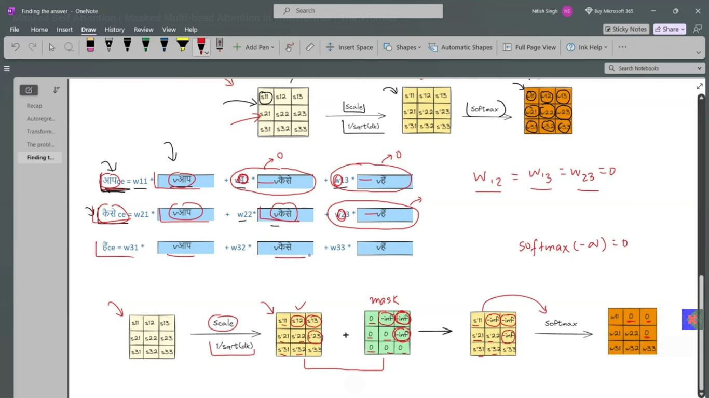

# Day_081 | 🎭 Masked Self-Attention: The Core of the Decoder

**Masked Self-Attention** is a crucial modification of the standard Self-Attention mechanism used exclusively in the **Transformer Decoder**. It is designed to preserve the **autoregressive** property necessary for sequence generation (like predicting the next word).

---

## 🏗️ Transformer Decoder Architecture (Part 1)

The Transformer Decoder is responsible for generating the output sequence one token at a time. It is also a stack of $N$ identical layers (usually $N=6$) but contains **three** sub-layers, whereas the Encoder has only two:

1.  **Masked Multi-Head Self-Attention:** Ensures that prediction for the current token only depends on previous tokens.
2.  **Multi-Head Cross-Attention (Encoder-Decoder Attention):** Allows the decoder to attend to the output of the Encoder.
3.  **Position-wise Feed-Forward Network (FFN):** Provides non-linearity, just like in the Encoder.

### Focus: The Masked Sub-Layer

In the Decoder's first sub-layer, the Query ($\mathbf{Q}$), Key ($\mathbf{K}$), and Value ($\mathbf{V}$) are all derived from the **partially generated output sequence**. This is where Masking is applied.

---

## 🛑 Why We Need Masked Self-Attention

### The Problem with Standard Self-Attention

If we used standard Self-Attention in the Decoder, when calculating the contextual embedding for the $t^{th}$ word, the attention mechanism would look at and be influenced by **all subsequent words** ($t+1, t+2, \dots, T$) in the target sequence.

* **Result:** The model would be cheating. It would simply look at the correct next word and predict it, failing to learn the necessary causal relationship required for actual generation (where the future is unknown).

### The Solution: The Mask

**Masked Self-Attention** solves this by enforcing a **causal constraint**. A **Look-Ahead Mask** is applied to the attention scores ($\mathbf{Q} \mathbf{K}^\top$) **before** the Softmax function is calculated.

* **Mechanism:** The mask is a matrix where all values in the upper-right triangle (corresponding to attending to future tokens) are set to **negative infinity** ($-\infty$).
* **Effect:** When Softmax is applied, $e^{-\infty}$ becomes zero. This forces the attention weights for all future tokens to be **zero**, effectively blocking the flow of information from future positions to the current position.

$$\text{Masked Attention} = \text{Softmax}\left(\frac{\mathbf{Q} \mathbf{K}^\top + \mathbf{M}}{\sqrt{d_k}}\right) \mathbf{V}$$

(Where $\mathbf{M}$ is the mask matrix containing $0$s or $-\infty$).

---

## 🕒 The Autoregressive Paradox

The statement **"The Transformer decoder is autoregressive at inference and non-autoregressive at training time"** refers to the efficiency gain achieved during training using the mask.

| Feature | Inference (Prediction) | Training (Learning) |
| :--- | :--- | :--- |
| **Autoregressive Mode**| **Autoregressive (Sequential)** | **Non-Autoregressive (Parallel)** |
| **Input** | The predicted token from $t-1$ is fed as input to predict $t$. | The entire correct target sequence is fed in all at once (Teacher Forcing). |
| **Why Parallel?** | The **Mask** ensures that the model can process the entire target sequence in parallel while still respecting the causal constraint. | Without the mask, the model would need to wait for $t-1$ to finish before starting $t$. |
| **Speed** | Slow (still sequential). | Extremely Fast (fully parallel). |

The key innovation is that the **Masked Self-Attention** provides the best of both worlds: it allows the training to be run **in parallel** (huge speed boost) while simulating the constraints of a **sequential (autoregressive)** generation process.

## 🔄 Why We Do Not Use Standard Self-Attention Here

The problem of parallelism is precisely why we must use the **Mask**.

If we used standard Self-Attention, we couldn't train the model in parallel because the gradient update for the weights at position $t$ would be influenced by the correct tokens at $t+1, t+2, \dots$. The network would learn to cheat by looking at the answer.

By using the **Masked Self-Attention**, the computational steps for all positions ($t=1$ to $T$) are run in parallel, and the mask **logically enforces the sequence order** without requiring physical sequential processing, thus solving the problem of parallel training.

---

## ⭐ TRANSFORMER DECODER (Part 1): Core Components

A Transformer decoder layer contains **3 sub-layers**:

```
1. Masked Multi-Head Self-Attention      (decoder looks at previous tokens)
2. Cross-Attention                       (decoder attends to encoder output)
3. Feed Forward Network                  (per-token MLP)
```

Today we only explain **Part 1: Masked Self-Attention**.

---

## ⭐ WHAT IS MASKED SELF-ATTENTION?

Remember normal (unmasked) self-attention in the encoder:

```
A token can attend to any other token in the sentence
```

→ This is fully bidirectional.

But **in the decoder**, we must predict next tokens **one-by-one**, so a token at position *i* must never see a token at position *j > i*.

Example for output sequence:

```
I   love   you   <end>
0    1      2
```

During prediction of:

* “I” → no future words allowed
* “love” → cannot see “you”
* “you” → cannot see `<end>`

So we enforce a **causal mask**:

```
      I   love   you
I     ✔    ✘      ✘
love  ✔    ✔      ✘
you   ✔    ✔      ✔
```

This mask is a **lower triangular matrix**.

---

## ⭐ FORMALLY: Masked Scaled Dot-Product Self-Attention

Normal attention:

$$
\text{softmax}\left(\frac{QK^T}{\sqrt{d_k}}\right)V
$$

Masked attention:

$$
\text{softmax}\left(\frac{QK^T + M}{\sqrt{d_k}}\right)V
$$

Where:

* $( M_{ij} = 0 ) if j ≤ i$
* $( M_{ij} = -\infty ) if j > i$

This ensures:

```
Future tokens get softmax probability = 0
```

---

## ⭐ MASKED MULTI-HEAD ATTENTION

Add the mask to each head:

```
Q = XW_q
K = XW_k
V = XW_v

Scores = (QK^T / sqrt(d_k)) + mask
Attn   = softmax(scores)
```

Nothing else changes — the mask just blocks future information.

---

## ⭐ WHY DO WE NEED MASKING IN THE DECODER?

Because the decoder is **autoregressive**.

That means:

```
Prediction at step t must not use information from step > t

Example:
Predicting "love" cannot use the future token "you".
```

---

## ⭐ KEY POINT:

#### ✔ Encoder = full self-attention (bidirectional)

#### ✔ Decoder = masked self-attention (causal, unidirectional)

This keeps generation logically correct.

---

## ⭐ “AUTOREGRESSIVE AT INFERENCE | NON-AUTOREGRESSIVE AT TRAINING”

This phrase confuses almost everyone. Here’s the clean explanation.

---

### ⭐ 1) DECODER IS **AUTOREGRESSIVE AT INFERENCE** (GREEDY, BEAM SEARCH, SAMPLING)

At test time (inference):

```
We generate one token at a time.
```

For example:

```
Input: I love
Output: ?

Step 1: predict token 1
Step 2: predict token 2 using previous predictions
Step 3: predict token 3 using previous predictions
```

Sequence is generated **incrementally**, one-by-one.

#### → This is called **autoregressive**.

---

### ⭐ 2) DECODER IS **NON-AUTOREGRESSIVE DURING TRAINING** (TEACHER FORCING)

During training we already know the target sentence.

Example target:

```
I love you
```

So during training we feed all tokens at once:

```
I love you
↓ ↓ ↓
Embed entire sequence
↓ ↓ ↓
Compute full masked attention in 1 forward pass
```

Even though the attention is masked (future hidden),
**all tokens are processed in parallel** because teacher-forcing supplies the whole target.

This is why training is fast.

#### → This is called **non-autoregressive computation** (but still causal).

---

## ⭐ SUMMARY OF THIS KEY IDEA

| Phase         | How decoding works                   | Why                           |
| ------------- | ------------------------------------ | ----------------------------- |
| **Training**  | Full sequence used in 1 forward pass | Parallelism + teacher forcing |
| **Inference** | Generate token-by-token              | Must not peek future tokens   |

---

## ⭐ WHY WE CANNOT REMOVE SELF-ATTENTION IN DECODER

Some people ask:

> “Why not just remove self-attention and only use encoder → decoder attention?”

But that *breaks language modeling*.

### Because the decoder must understand:

* grammar
* what it already generated
* sentence structure
* long-term dependencies across output tokens

Example:

```
The dogs in the yard ____ hungry.
```

The decoder needs **previous tokens** to determine:

* number agreement
* structure
* meaning

Without self-attention, it would have no memory of earlier outputs.

---

## ⭐ THE PARALLELISM PROBLEM

### ✔ At training time → complete parallelism

We process full sequences at once using masking.

### ✔ At inference time → NO parallelism

We must generate **one token at a time**:

```
Generate y1
Feed back y1
Generate y2
Feed back y1,y2
Generate y3
...
```

So a 20-token output requires **20 forward passes**.

This is called the **parallelism gap** between training and inference.

It is the reason why:

* inference is slow
* models like Whisper, GPT, and LLaMA generate sequentially
* non-autoregressive models were proposed (but inferior quality)

---

## ⭐ WHY DOES TRAINING ALLOW PARALLELISM BUT INFERENCE DOES NOT?

### Training:

We know the full answer, so we can feed:

```
I love you
```

and compute all masked attentions at once.

### Inference:

We **do not know the correct next token**, so we cannot feed it in parallel.

We must generate token 1 first, then token 2, etc.

---

## ⭐ FULL CONCEPTUAL SUMMARY (CHEAT SHEET)

```
Masking = prevents looking at future tokens.

Decoder uses masked self-attention:
  → enforces autoregressive behavior.

Training:
  → teacher forcing gives full sequence
  → model computes all positions in parallel
  → this is non-autoregressive compute

Inference:
  → no teacher forcing
  → must generate 1 token at a time
  → autoregressive generation
  → no parallelism
```

---

## Images
