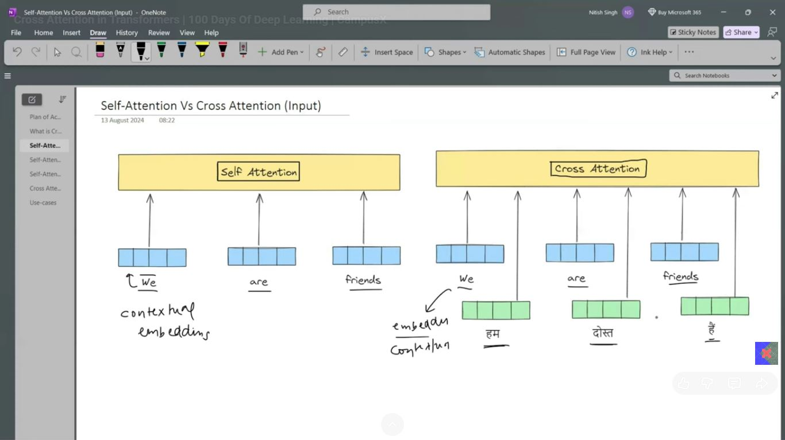
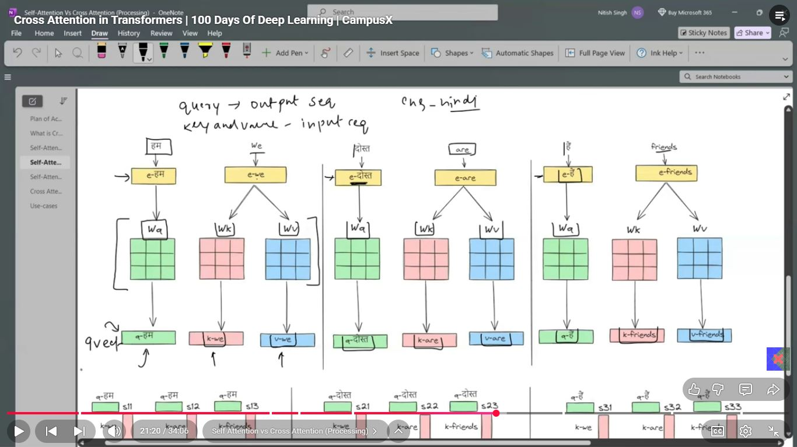
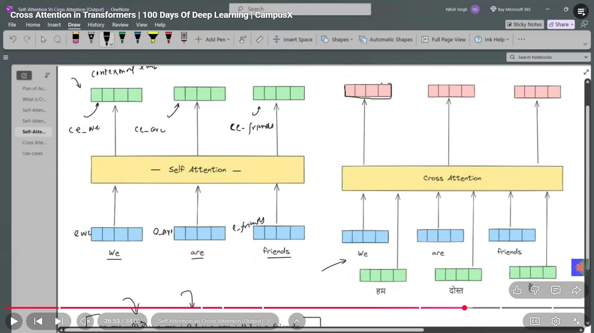
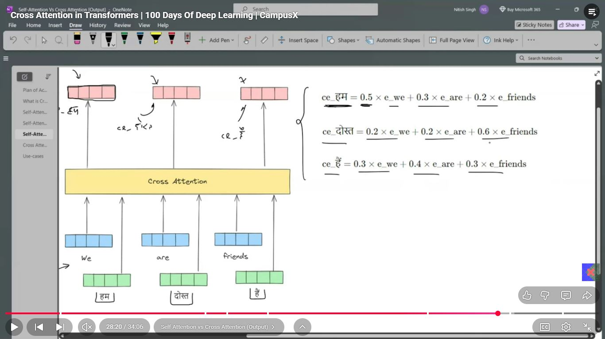

# Day_082 | 🧩 Cross-Attention (Encoder-Decoder Attention)

**Cross-Attention** is the second, most critical attention sub-layer found exclusively in the **Transformer Decoder**. Its primary purpose is to allow the Decoder to look at and extract relevant information from the contextual representations generated by the **Encoder**. It is the mechanism that links the source sequence (Encoder output) to the target sequence being generated (Decoder input).

---

## 🏗️ Architecture and How It Works

Cross-Attention is structurally similar to Self-Attention but sources its three vectors (**Q, K, V**) from two different places:

| Vector | Source | Role |
| :--- | :--- | :--- |
| **Query ($\mathbf{Q}$)** | **Decoder's Masked Self-Attention Output.** (The representation of the sequence generated so far). | *What am I looking for (in the source sequence)?* |
| **Keys ($\mathbf{K}$)** | **Encoder's Final Output.** (The contextualized representation of the input sequence). | *What do I have to offer (from the source)?* |
| **Values ($\mathbf{V}$)** | **Encoder's Final Output.** (The content vectors to be aggregated). | *What content should I pass back?* |

### The Calculation

The calculation proceeds using the standard Scaled Dot-Product Attention formula, but with the mixed-source inputs:

$$\text{Cross-Attention}(\mathbf{Q}, \mathbf{K}, \mathbf{V}) = \text{Softmax}\left(\frac{\mathbf{Q}_{\text{decoder}} \mathbf{K}_{\text{encoder}}^\top}{\sqrt{d_k}}\right) \mathbf{V}_{\text{encoder}}$$

### Intuition (Alignment)

During Machine Translation, if the Decoder is trying to output the word "blue," the Cross-Attention mechanism will query the Encoder's output for information related to "color" and "object." It will likely assign high attention scores (weights) to the source language word that translates to "blue," thus **aligning** the current output step with the relevant input part.

---

## ↔️ Cross-Attention vs. Self-Attention

The two mechanisms are fundamentally similar in their mathematical operation but differ entirely in their purpose and the source of their inputs.

| Feature | Self-Attention | Cross-Attention |
| :--- | :--- | :--- |
| **Input Source** | **Single Sequence** (all Q, K, V come from the same layer output/sequence). | **Dual Sequences** (Q from Decoder, K/V from Encoder). |
| **Purpose** | **Contextualization:** To establish relationships *within* a sequence. | **Alignment/Transfer:** To establish relationships *between* two different sequences. |
| **Contextual Output** | Creates a better representation of the **input sequence**. | Creates a better representation of the **target sequence** by incorporating source information. |
| **Masking** | **Masked** in the Decoder; **Unmasked** in the Encoder. | **Never Masked** (it doesn't violate causality to look at the full source sequence). |
| **Where Used** | **Encoder** (all layers) and **Decoder** (first sub-layer). | **Decoder only** (second sub-layer). |

### Similarities

1.  **Core Formula:** Both use the exact same Scaled Dot-Product Attention calculation: $\mathbf{Q} \mathbf{K}^\top$ followed by Softmax and multiplication by $\mathbf{V}$.
2.  **Learnable Parameters:** Both utilize **Multi-Head** parallelism and require separate, trainable weight matrices ($\mathbf{W}_Q, \mathbf{W}_K, \mathbf{W}_V$) for each head.
3.  **Output Structure:** Both output a sequence of vectors that have the same dimension as the input Query vectors.

---

## 🔥 1. What is Cross-Attention?

Cross-attention happens in the **decoder**, between:

* **Queries (Q)** from the decoder
* **Keys (K)** and **Values (V)** from the encoder

So:

```
Q = decoder hidden states
K = encoder output states
V = encoder output states
```

This is different from self-attention where **Q, K, V all come from the same sequence**.

Cross-attention is the **bridge** between:

#### ✔ the encoder’s understanding of the input sentence

#### ✔ the decoder’s current generation state

---

## 🔥 2. Why does the decoder *need* cross-attention?

Short answer:

> Cross-attention tells the decoder which parts of the source sentence are relevant at
> each decoding step.

Example: Translate

```
ENGLISH: "The cat sat on the mat"
FRENCH: "Le chat s’est assis sur le tapis"
```

When generating French token `"tapis"`:

* the decoder Query comes from “I am generating the last word”
* the encoder Keys/Values contain the entire meaning of the English sentence
* cross-attention will focus (high weights) on the word "mat"

This allows the decoder to **point to the correct part of the input**.

### Without cross-attention → transformer cannot translate.

---

## 🔥 3. How cross-attention works (formulas)

Self-attention:

$$
Q = XW_Q,\quad K = XW_K,\quad V = XW_V
$$

Cross-attention:

$$
Q = YW_Q         \quad \text{(decoder)}\
K = HW_K,\quad V = HW_V   \quad \text{(encoder)}
$$

Where:

* ( Y ) = decoder’s hidden states (so far)
* ( H ) = encoder output representations

Attention:

$$
\text{softmax}\left(\frac{QK^T}{\sqrt{d_k}}\right)V
$$

This computes how much **decoder’s current Query** attends to **each encoder token**.

---

## 🔥 4. Visual Diagram of Cross Attention

### Self-attention (Encoder):

```
x1  x2  x3  x4
|   |   |   |
↓   ↓   ↓   ↓
Q,K,V all from [x1, x2, x3, x4]
```

### Cross-attention (Decoder):

```
DE (decoder hidden states) → Q
EN (encoder output states) → K, V
```

Diagram:

```
Decoder states (partial output)
      │
      ▼     Q
    [decoder]
      │
      │           K, V
      ▼         [encoder outputs]
Cross-attention ----------------→ selects relevant encoder tokens
```

---

## 🔥 5. Where cross-attention fits inside a decoder layer

Decoder layer:

```
1. Masked Self-Attention      ← looks at previous decoder tokens
2. Cross-Attention            ← looks at encoder outputs
3. Feed Forward Network
```

### Why this order?

* First the decoder looks at **what it has generated so far**
* Then it looks at the **input sentence**
* Then it applies a local transformation (FFN)

---

## 🔥 6. Difference Between Self-Attention and Cross-Attention

### ✔ 1. Source of Q, K, V

| Mechanism           | Query         | Key         | Value       |
| ------------------- | ------------- | ----------- | ----------- |
| **Self-attention**  | Same sequence | Same        | Same        |
| **Cross-attention** | Decoder seq   | Encoder seq | Encoder seq |

---

### ✔ 2. Masking behavior

| Mechanism                  | Mask?             | Why                                      |
| -------------------------- | ----------------- | ---------------------------------------- |
| **Decoder Self-Attention** | Yes (causal mask) | Prevent peeking future tokens            |
| **Cross-Attention**        | No mask           | Decoder should see entire encoder output |

---

### ✔ 3. Role in model

| Mechanism           | Purpose                                       |
| ------------------- | --------------------------------------------- |
| **Self-attention**  | Understand relationships within same sentence |
| **Cross-attention** | Align decoder tokens to encoder input tokens  |

---

## 🔥 7. Similarities Between Self-Attention and Cross-Attention

Despite different roles, the algorithms are **almost identical**.

| Similarity                 | Explanation            |
| -------------------------- | ---------------------- |
| Uses Q, K, V projections   | same formula           |
| Same dot-product attention | (QK^T/\sqrt{d_k})      |
| Same softmax + weighting   | identical computation  |
| Same multi-head structure  | parallel heads         |
| Same residual + LayerNorm  | identical block design |

The only difference is **where Q, K, V come from**.

---

## 🔥 8. Intuition Boost: How Cross-Attention “Chooses” Input Words

Consider decoding: `"Je"` `"suis"` `"fatigué"`

At step generating `"fatigué"`:

The decoder query = “I am generating a word about tiredness.”

The encoder keys/values = embeddings of:

```
I    am    tired
```

Cross-attention will:

* give high weights to "tired"
* give low weights to "I", "am"

So the decoder knows which input word is relevant for producing that output.

This is exactly how attention replaced RNN sequence alignment.

---

## 🔥 9. Pseudo-code for Cross-Attention (PyTorch style)

```python
# Q comes from decoder hidden states
Q = decoder_states @ W_q

# K, V come from encoder sequence
K = encoder_states @ W_k
V = encoder_states @ W_v

# attention scores (no mask needed)
scores = (Q @ K.transpose(-2, -1)) / sqrt(d_k)

# softmax & context
attn = softmax(scores)
context = attn @ V
```

---

## 🔥 10. Why Cross-Attention Is Essential (3 Key Reasons)

### ✔ Reason 1 — The decoder must know which input word to translate

Otherwise, the decoder produces output blindly.

### ✔ Reason 2 — Attention replaces RNN encoder–decoder alignment

Classic seq2seq with RNNs used Bahdanau attention.
Transformers replaced that with cross-attention.

### ✔ Reason 3 — Cross-attention gives interpretability

You can view attention maps to see what word the model is “looking at”.

---

## 🎯 Final Summary

```
Self Attention:
    Q,K,V from same sequence
    Encoder → bidirectional
    Decoder → masked (causal)

Cross Attention:
    Q from decoder
    K,V from encoder
    No mask (decoder should see full input)
```

Cross-attention is **the glue** that lets the decoder use the encoder’s representations to produce correct output sequences (translation, summarization, generation).

---

## Images



