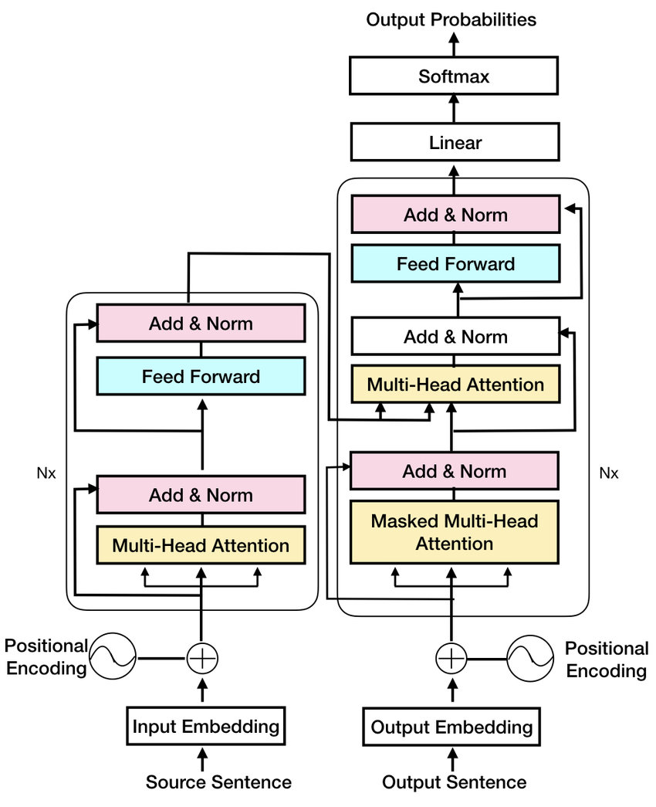
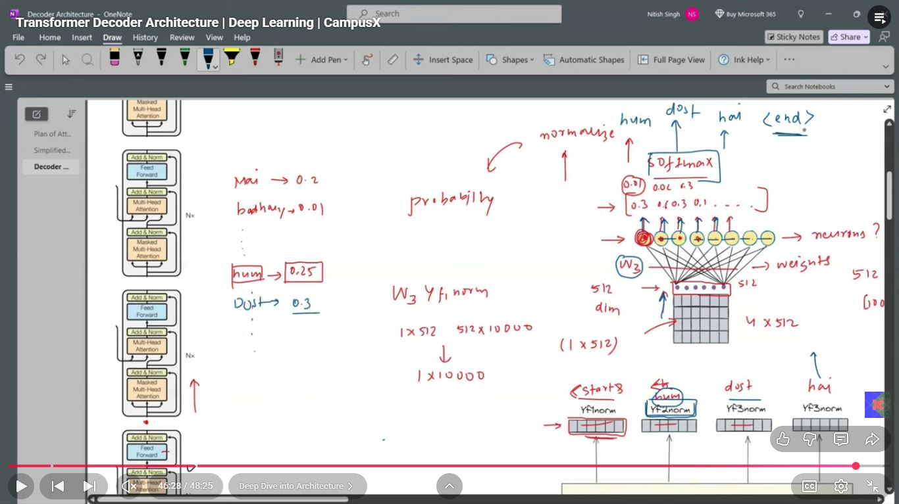
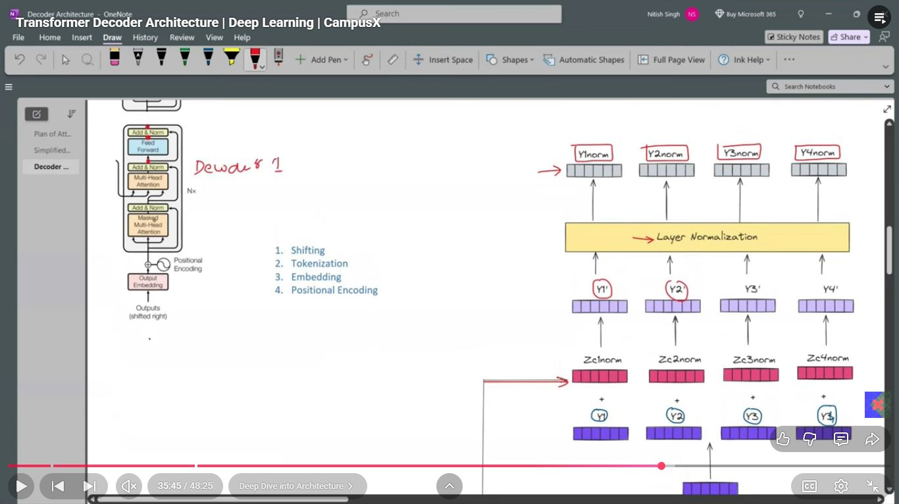
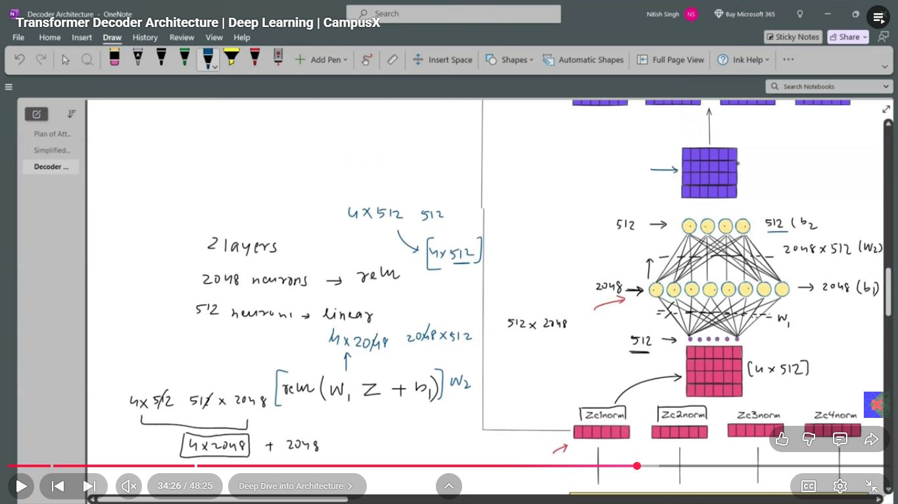
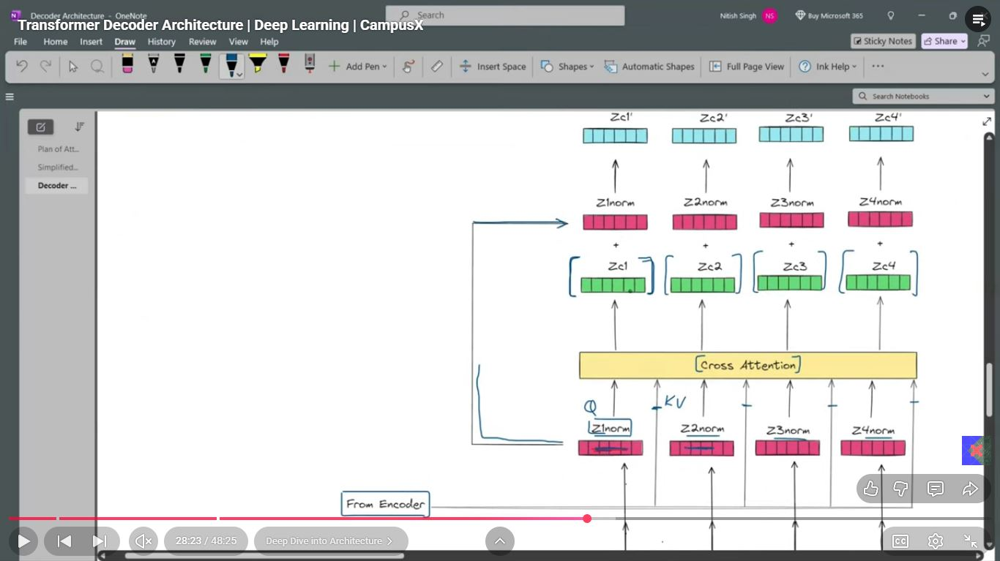
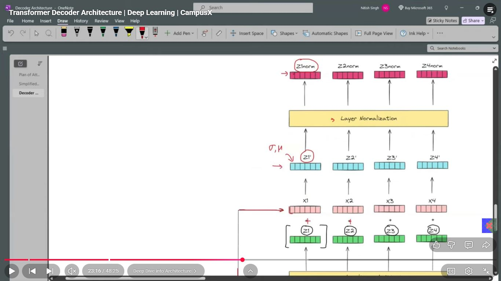
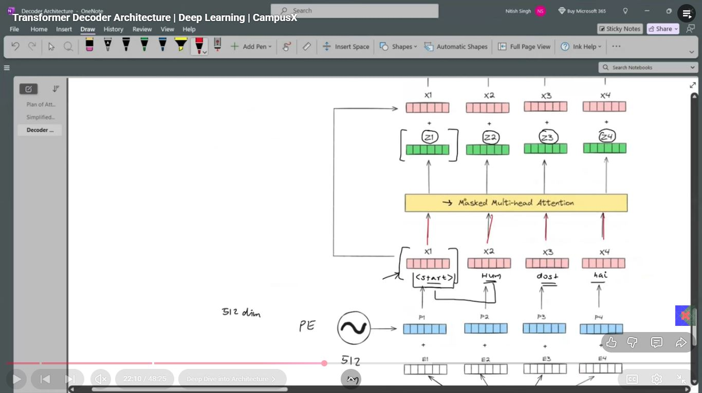
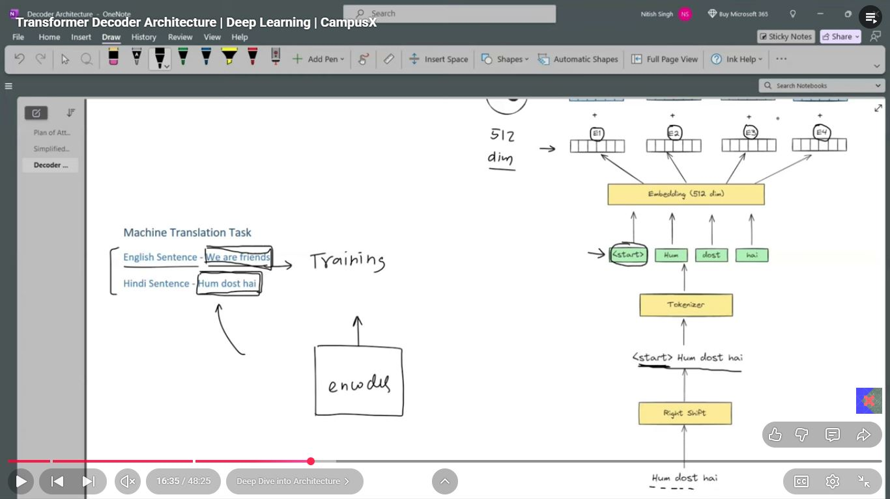

# Day_083 | 🏗️ Transformer Decoder Architecture
The **Transformer Decoder** is the generative half of the Transformer architecture, responsible for taking the contextualized representation from the Encoder and generating the target output sequence (e.g., translating text, summarizing, or continuing a sentence) one token at a time.

Like the Encoder, the Decoder is a stack of $N$ identical layers (typically $N=6$).

---

## 🏗️ Architecture of One Decoder Layer

Each Decoder layer is composed of **three** main sub-layers, which are arranged sequentially and surrounded by **Residual Connections** and **Layer Normalization**:

1.  **Masked Multi-Head Self-Attention:** Processes the output sequence generated so far.
2.  **Multi-Head Cross-Attention (Encoder-Decoder Attention):** Gathers context from the final output of the Encoder stack.
3.  **Position-wise Feed-Forward Network (FFN):** Provides non-linearity and feature refinement.

### 1. Masked Multi-Head Self-Attention

This is the first attention sub-layer, processing the target sequence that is being generated.

* **Mechanism:** It ensures the **autoregressive** property of the decoder. A **Look-Ahead Mask** is applied to the attention scores to prevent the decoder from "seeing" and cheating by attending to tokens that have not yet been generated (tokens at position $t+1$ and beyond).
* **Input:** Query ($\mathbf{Q}$), Key ($\mathbf{K}$), and Value ($\mathbf{V}$) are all derived from the **previous output of the decoder**.

### 2. Multi-Head Cross-Attention (Encoder-Decoder Attention)

This is the critical linking sub-layer that connects the Decoder to the Encoder.

* **Mechanism:** It calculates the relevance between the partially generated target sequence and the entire source sequence. It allows the decoder to focus on the parts of the input necessary for the next prediction.
* **Input:**
    * **Query ($\mathbf{Q}$):** Comes from the output of the **Masked Self-Attention** sub-layer (the decoder's current understanding).
    * **Keys ($\mathbf{K}$) and Values ($\mathbf{V}$):** Come from the final output of the **Encoder stack**.

### 3. Position-wise Feed-Forward Network (FFN)

This sub-layer is identical to the one in the Encoder.

* **Mechanism:** It provides the model with the necessary **non-linearity** and capacity to refine the contextual information pooled from both the self-attention and cross-attention sub-layers.

---

## ➡️ Final Output Layer

After the final Decoder layer, the output is converted into a probability distribution over the vocabulary:

1.  **Linear Projection:** The final contextualized output sequence is passed through a **Dense layer** (linear transformation).
2.  **Softmax:** The output of the linear layer is passed through the **Softmax function** to generate probabilities for the next token, ensuring the sum of all probabilities equals one.

The token with the highest probability is selected as the next generated word.

## 🔄 Decoder Data Flow Summary

The overall Transformer architecture shows the flow of data from the Encoder input, through the Encoder stack, and then into the Decoder stack via the Cross-Attention mechanism. 


---

## Overview

The Transformer decoder (from *Attention Is All You Need*, Vaswani et al., 2017) is responsible for **autoregressive output generation** in tasks like:

* machine translation
* text generation
* summarization
* speech transcription
* code generation

The decoder operates on **previously generated tokens** and uses **encoder information** to produce the next output token.

A Transformer decoder is composed of **N identical layers** (N = 6 in the original paper), where each layer contains three sub-layers:

1. **Masked Multi-Head Self-Attention**
2. **Encoder–Decoder Cross-Attention**
3. **Position-wise Feed-Forward Network (FFN)**

Every sub-layer uses **residual connections + Layer Normalization**.

---

## 📘 **1. Decoder Input and Embeddings**

### 1.1 Token Embeddings

Each target token is mapped to a `d_model` dimensional vector using a learned embedding matrix.

### 1.2 Positional Encoding

Since attention is permutation invariant, a positional encoding (sinusoidal or learned) is added:

$$
X = E_{\text{token}} + E_{\text{pos}}
$$

---

## 📘 **2. Decoder Layer Structure**

Each decoder layer consists of:

```
┌──────────────────────────────────────────┐
│              Decoder Layer               │
│                                          │
│  1. Masked Multi-Head Self-Attention     │
│  2. Encoder–Decoder Cross-Attention       │
│  3. Feed Forward Network (FFN)            │
│                                          │
│ + Residual connections                   │
│ + Layer Normalization                    │
└──────────────────────────────────────────┘
```

Modern architectures use **Pre-LayerNorm**, while the original paper used **Post-LN**.

---

## 📘 **3. Masked Multi-Head Self-Attention**

### 3.1 Purpose

Enables the decoder to attend to **previously generated tokens**.

### 3.2 Causal Mask

To preserve autoregressive behavior, a **causal mask** blocks access to future positions.

Mask matrix (for seq length = 4):

```
1 0 0 0  
1 1 0 0  
1 1 1 0  
1 1 1 1
```

This ensures token `t` cannot attend to tokens `> t`.

### 3.3 Formula

Self-attention:

$$
Q = XW_Q,\quad K = XW_K,\quad V = XW_V
$$

Masking:

$$
\text{Attention}(Q,K,V) = \text{softmax}\left(\frac{QK^T + M}{\sqrt{d_k}}\right)V
$$

---

## 📘 **4. Encoder–Decoder Cross-Attention**

### 4.1 Purpose

Allows the decoder to attend to the encoder outputs.
This is essential for tasks like translation, where the output must be conditioned on an input sequence.

### 4.2 Where Q, K, V come from

* **Queries (Q)** come from the **decoder**
* **Keys (K)** and **Values (V)** come from the **encoder**

$$
Q = YW_Q  \quad\text{(decoder)}
$$

$$
K = HW_K, \quad V = HW_V \quad\text{(encoder)}
$$

Cross-attention identifies which parts of the input sequence are relevant for generating the next output token.

### 4.3 No Mask Needed

The decoder must have full access to the entire encoder representation.

---

## 📘 **5. Feed-Forward Network (FFN)**

### 5.1 Architecture

Each token is processed independently by a 2-layer MLP:

$$
\text{FFN}(x) = W_2 \sigma(W_1 x + b_1) + b_2
$$

With expansion:

```
d_model → d_ff → d_model
```

Commonly:

```
512 → 2048 → 512
```

### 5.2 Purpose

Adds nonlinear transformation capacity per token.

---

## 📘 **6. Residual Connections and Layer Normalization**

Each sub-layer is wrapped with:

1. Residual connection:
   [
   x + \text{sublayer}(x)
   ]

2. LayerNorm:

   * **Pre-LN** (modern)
   * **Post-LN** (original paper)

Pre-LN improves training stability, especially when stacking many layers.

---

## 📘 **7. Full Decoder Layer (Modern Pre-LN Form)**

```
x = decoder input
y = encoder output

1) x1 = x + Dropout(SelfAttention(LN(x)))
2) x2 = x1 + Dropout(CrossAttention(LN(x1), y))
3) x3 = x2 + Dropout(FFN(LN(x2)))

return x3
```

---

## 📘 **8. Autoregressive vs Non-Autoregressive Behavior**

### 8.1 Autoregressive at Inference

At inference:

```
We generate one token at a time.
```

Token t can only use information from tokens `< t`.

Thus:

* generation is sequential
* no parallelism
* masked self-attention ensures correct behavior

This leads to slower inference but correct next-token prediction.

---

### 8.2 Non-Autoregressive at Training (with Teacher Forcing)

During training:

```
We know the ground truth sequence.
```

So we feed the entire target sentence at once.

Masked self-attention still blocks future tokens **inside the model**,
but we can compute all positions **in parallel**.

This gives huge training speedups.

---

## 📘 **9. Parallelism Problem**

During training → fully parallel due to teacher forcing.
During inference → sequential, token-by-token.

This gap leads to:

* slower inference
* beam search limits
* attempts at non-autoregressive models (NAT), which produce worse quality

---

## 📘 **10. Encoder vs Decoder Comparison (Summary)**

| Feature         | Encoder                          | Decoder                                |
| --------------- | -------------------------------- | -------------------------------------- |
| Self-Attention  | Bidirectional                    | Masked (causal)                        |
| Cross-Attention | ✘                                | ✔                                      |
| Inputs          | Source sentence                  | Previously generated tokens            |
| Purpose         | Build contextual representations | Generate next output token             |
| Parallelism     | Full                             | Masked, causes inference sequentiality |

---

## 📘 **11. Why Cross-Attention Is Essential**

Without cross-attention:

* The decoder cannot access the input sentence
* No alignment between input and output
* Translation and conditional generation would fail

Cross-attention acts as the **bridge** from encoder to decoder.

---

## 📘 **12. Diagram: Full Decoder Layer**

```
                   ┌───────────────────────┐
                   │  Masked Self-Attn     │
Decoder Input ───► │   (causal mask)       │
                   └───────┬───────────────┘
                           │
                           ▼
                   ┌───────────────────────┐
                   │  Cross Attention       │
                   │   (encoder → decoder)  │
                   └───────┬───────────────┘
                           │
                           ▼
                   ┌───────────────────────┐
                   │ Feed Forward Network   │
                   └────────────────────────┘
                              │
                              ▼
                        Decoder Output
```

---

## 📘 **13. Summary (Cheat Sheet)**

```
Decoder =
    - Masked Self-Attention → looks at previous outputs
    - Cross Attention → looks at encoder outputs
    - FFN → local transformation
    - Residual + LayerNorm

Training = non-autoregressive (parallel using teacher forcing)
Inference = autoregressive (one token at a time)
```

---

## Images








