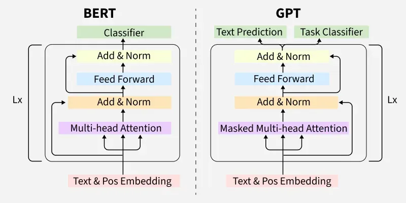
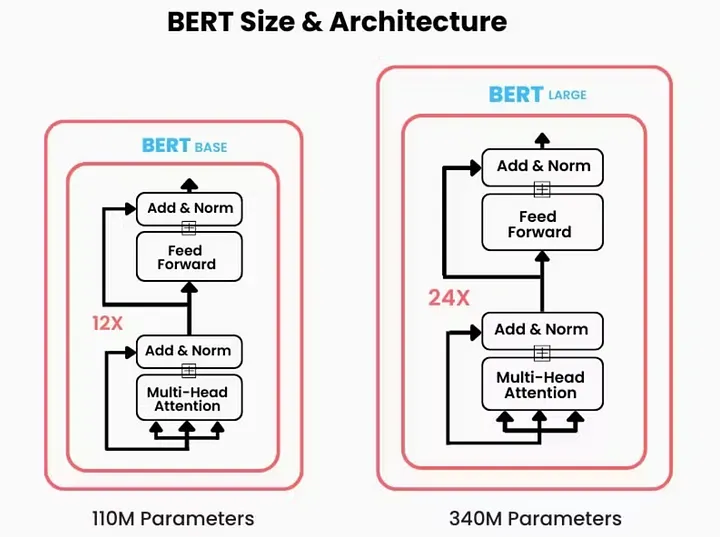
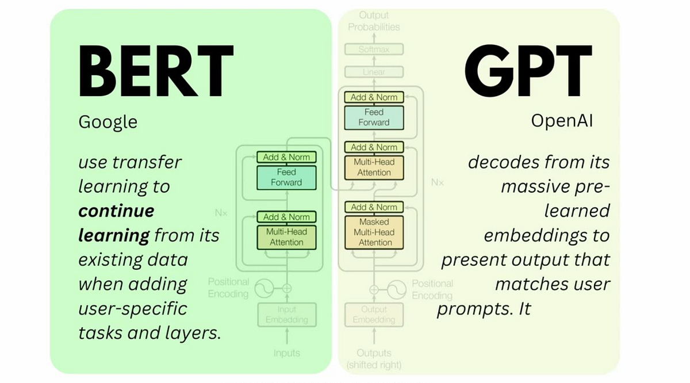
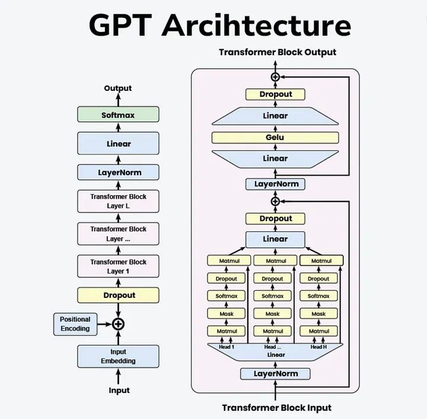

# Day_085 | 🤖 Transformer Classes | Encoder-Only Transformer | Decoder-Only Transformer | Encoder-Decoder Transformer

---

## **1. Encoder-Only Transformer (e.g., BERT, RoBERTa)**

This architecture is focused on **understanding** the context and relationships within a single sequence of input text.

* **Primary Goal:** To generate a **contextual representation** (or "understanding") for every token in the input sequence.
* **Structure:** Consists solely of a stack of **Encoder layers**.
* **How it Works:** The input sequence (e.g., a sentence) passes through the encoders. The **Self-Attention mechanism** allows each token to attend to *all other tokens* in the same input sequence, providing a rich, bidirectional context.
* **Key Feature:** **Bidirectional Context**—it processes the sentence from left-to-right *and* right-to-left simultaneously.
* **Typical Tasks:**
    * **Classification:** Sentiment analysis, topic labeling.
    * **Token-level Prediction:** Named Entity Recognition (NER), Masked Language Modeling (MLM).
    * **Question Answering (Extractive):** Finding the answer span in a given passage.

---

## **2. Decoder-Only Transformer (e.g., GPT, Llama)**

This architecture is focused on **generating** new sequences, token by token.

* **Primary Goal:** To generate a probable next token given the preceding tokens in a sequence, effectively **generating coherent text**.
* **Structure:** Consists solely of a stack of **Decoder layers**.
* **How it Works:** Uses a **Masked Self-Attention** mechanism. This masking ensures that when predicting the next word, a token can *only* attend to the tokens that came **before** it in the sequence. This enforces a strictly **unidirectional (left-to-right)** context, which is necessary for generation.
* **Key Feature:** **Unidirectional Context**—its primary function is auto-regressive (generating text one word at a time based on what has already been generated).
* **Typical Tasks:**
    * **Generative Language Modeling:** Creating essays, stories, or code.
    * **Conversational AI:** Acting as a chatbot.
    * **Prompt-based Generation:** Completing prompts or instructions.

---

## **3. Encoder-Decoder Transformer (or Full Transformer) (e.g., T5, BART, Original Transformer)**

This architecture is designed for **sequence-to-sequence (seq2seq) tasks**, mapping an input sequence to a different output sequence.

* **Primary Goal:** To transform an input sequence into a corresponding output sequence.
* **Structure:** Composed of a stack of **Encoder layers** and a stack of **Decoder layers**.
* **How it Works:**
    1.  **Encoder:** Processes the input sequence bidirectionally to create a dense contextual representation.
    2.  **Decoder:** Uses this representation, along with its own masked self-attention over the already generated output, to **generate the output sequence** one token at a time. A crucial component is the **Cross-Attention** layer, which allows the decoder to look at the **entire encoded input** at every step of generation.
* **Key Feature:** **Sequence-to-Sequence Mapping** using both contextual encoding and constrained generation.
* **Typical Tasks:**
    * **Machine Translation:** Translating text from one language to another.
    * **Summarization:** Generating a shorter summary from a long document.
    * **Code Generation (from natural language).**

---

## **💡 Summary Comparison Table**

| Feature | Encoder-Only | Decoder-Only | Encoder-Decoder |
| :--- | :--- | :--- | :--- |
| **Example Models** | BERT, RoBERTa | GPT, Llama | T5, BART |
| **Main Component** | Encoder Stack | Decoder Stack | Encoder + Decoder Stacks |
| **Attention Type** | Bidirectional | Unidirectional (Masked) | Bidirectional (Encoder) + Unidirectional (Decoder) + Cross-Attention |
| **Primary Focus** | Context **Understanding** | Text **Generation** | Sequence **Transformation** |
| **Typical Tasks** | Classification, NER | Chatbots, Writing | Translation, Summarization |

---

## 🔷 **1. Encoder-Only Transformers**

These use **just the encoder stack** from the original Transformer.

### ✔️ Strengths

* Excellent at **understanding** text
* Bidirectional context (looks left + right)
* Good for classification and embedding tasks

### ✔️ Common Uses

* Text classification
* Sentiment analysis
* Named Entity Recognition (NER)
* Question answering (extractive)

### ✔️ Popular Encoder-Only Models

| Model                        | Notes                                        |
| ---------------------------- | -------------------------------------------- |
| **BERT**                     | First major encoder-only model               |
| **RoBERTa**                  | Improved BERT with more training             |
| **DistilBERT**               | Smaller, faster BERT                         |
| **ALBERT**                   | Parameter-sharing, lighter                   |
| **DeBERTa**                  | Enhanced attention mechanisms                |
| **Vision Transformer (ViT)** | Applies Transformer encoder to image patches |

---

## 🔷 **2. Decoder-Only Transformers**

These use **just the decoder stack**, in an autoregressive (left-to-right) manner.

### ✔️ Strengths

* Great at **generating** text
* Predicts next token one step at a time
* Forms the basis of modern large language models (LLMs)

### ✔️ Common Uses

* Chatbots
* Text generation
* Code generation
* Story writing
* Reasoning LLMs

### ✔️ Popular Decoder-Only Models

| Model                 | Notes                                |
| --------------------- | ------------------------------------ |
| **GPT (1–5)**         | Standard autoregressive transformers |
| **Llama**             | Open-source LLMs                     |
| **Mistral / Mixtral** | Efficient LLMs                       |
| **Phi models**        | Smaller, high-performance            |
| **RWKV** (hybrid)     | RNN-like with Transformer features   |

---

## 🔷 **3. Encoder-Decoder (Seq2Seq) Transformers**

These use both:

* **Encoder** → processes input
* **Decoder** → generates output

### ✔️ Strengths

* Best for mapping **one sequence to another**
* Bidirectional understanding + autoregressive generation

### ✔️ Common Uses

* Machine translation
* Text summarization
* Paraphrasing
* Text-to-text tasks (like T5)
* Speech-to-text (Whisper)

### ✔️ Popular Encoder-Decoder Models

| Model                                      | Notes                                  |
| ------------------------------------------ | -------------------------------------- |
| **T5 (Text-to-Text Transfer Transformer)** | All tasks treated as text-to-text      |
| **BART**                                   | Combines encoder + decoder + denoising |
| **mBART**                                  | Multilingual seq2seq                   |
| **Whisper**                                | Encoder-decoder speech recognition     |
| **PEGASUS**                                | Summarization optimized                |

---

## 🔷 **Other Specialized Transformer Variants**

### 🧠 **4. Vision Transformers (ViT and variants)**

Treat images as sequences of patches.

Examples:

* **ViT**
* **Swin Transformer**
* **DeiT**

---

### 🧠 **5. Hybrid Transformers**

Combine Transformers with CNNs, RNNs, or other architectures.

Examples:

* **Perceiver / Perceiver IO** (handles large inputs)
* **Conformer** (Transformer + CNN for speech)
* **U-ViT** (Transformer for segmentation)

---

## 🧠 **6. Efficient or Lightweight Transformers**

Designed to reduce compute cost and memory.

Examples:

* **Linformer**
* **Reformer**
* **Longformer**
* **BigBird**
* **Performer**

---

## 🧠 **7. Multimodal Transformers**

Handle multiple types of data together: text, images, audio.

Examples:

* **CLIP** (image + text)
* **Flamingo**
* **GPT-4V / Gemini**
* **BLIP-2**

---

## ⭐ Summary Table

| Category            | Parts Used              | Typical Use   |
| ------------------- | ----------------------- | ------------- |
| **Encoder-Only**    | Encoder ✔️ / Decoder ❌  | Understanding |
| **Decoder-Only**    | Encoder ❌ / Decoder ✔️  | Generation    |
| **Encoder-Decoder** | Encoder ✔️ / Decoder ✔️ | Seq-to-Seq    |

---

## Images

