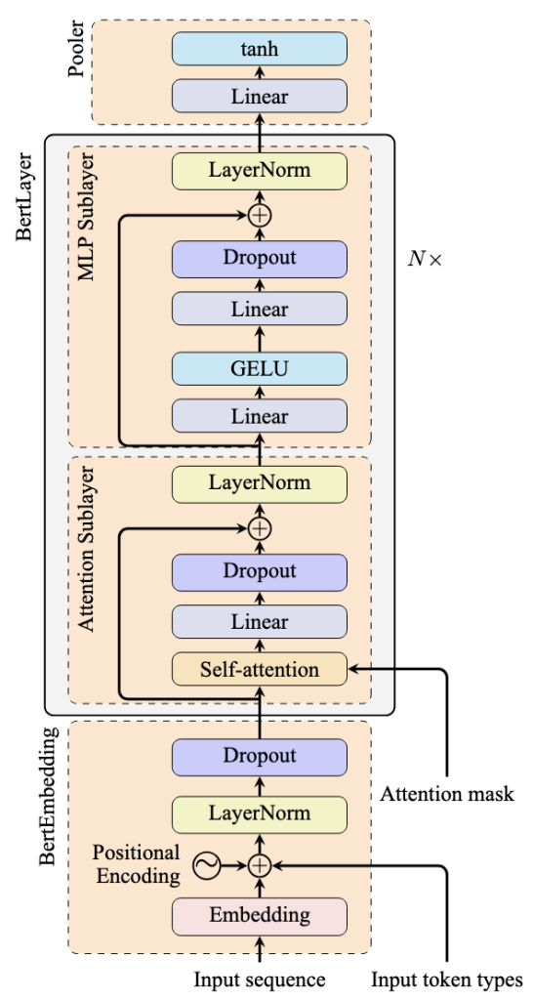

# Day_086 | 🏗️ Encoder-Only Transformer

The **Encoder-Only Transformer** architecture uses only the **Encoder** stack of the original Transformer model. Its primary focus is on **understanding and generating rich, contextualized representations** of the input sequence, rather than generating a new output sequence.

The most famous example of this architecture is **BERT** (Bidirectional Encoder Representations from Transformers).

---

## 🏗️ Core Architecture and Mechanism

### 1. Stacked Encoder Layers
The model consists of multiple identical **Encoder blocks** stacked one on top of the other (e.g., BERT Base has 12 layers, BERT Large has 24 layers).

### 2. Bidirectional Self-Attention
This is the defining feature of the Encoder-Only architecture:
* **What it is:** The **Self-Attention** mechanism within each layer allows every token in the input sequence to attend to **all other tokens** in the same sequence, both before it and after it.
* **Why it's important:** This creates a **bidirectional** (two-way) context for every word. For example, in the sentence "The **bank** is near the river," the model processes "bank" by looking at both "The" and "is near the river," allowing it to disambiguate the word's meaning (financial institution vs. river edge).

### 3. Output
The final output is a sequence of **contextualized vectors (embeddings)**, one for each input token. These vectors are a dense numerical summary of the token's meaning based on its full context within the sentence.

---

## 🎯 Primary Focus and Applications

Because it excels at deep contextual understanding, the Encoder-Only architecture is best suited for **Natural Language Understanding (NLU)** tasks. It does **not** generate free-form text.

| Task Category | Application | Description |
| :--- | :--- | :--- |
| **Classification** | Sentiment Analysis, Topic Labeling, Spam Detection | Classifying an entire input sequence (e.g., Is the review Positive or Negative?). |
| **Token-Level** | Named Entity Recognition (NER) | Identifying and classifying entities (e.g., people, places, organizations) within the text. |
| **Pairwise/Comparison** | Extractive Question Answering, Semantic Similarity | Finding a span of text in a document that answers a question, or determining if two sentences mean the same thing. |
| **Pre-training** | Masked Language Modeling (MLM) | The model is trained to predict words that have been randomly masked out of the input, forcing it to learn context bidirectionally. |

---

## 💡 Key Models

* **BERT** (Bidirectional Encoder Representations from Transformers)
* **RoBERTa**
* **ELECTRA**
* **DistilBERT**
  

Below is a **clear, complete explanation** of **Encoder-Only Transformers** — *what they are, how they work, why they are designed this way, and what exactly the output of a BERT encoder looks like.*

---

## 🔷 **1. What Is an Encoder-Only Transformer?**

An **Encoder-Only Transformer** is a model that uses **only the encoder block** of the original *“Attention is All You Need”* Transformer architecture.

These models:

* read the **entire sentence at once**
* understand the **context in both directions** (left and right)
* produce **contextual embeddings** for each token
* are used for **understanding**, not generating text

---

## 🔷 **2. Examples of Encoder-Only Models**

Major encoder-only models include:

#### ✔ BERT (Bidirectional Encoder Representations from Transformers)

#### ✔ RoBERTa

#### ✔ DistilBERT

#### ✔ ALBERT

#### ✔ DeBERTa

#### ✔ ELECTRA

#### ✔ Sentence-BERT (SBERT)

All of these share the same concept: **deep bidirectional context understanding.**

---

## 🔷 **3. How Does an Encoder-Only Transformer Work?**

Let’s walk through the process using **BERT** as the example.

---

## **Step 1: Tokenization**

Input sentence:

```
"The cat sat on the mat."
```

Tokens → IDs → Embeddings.

BERT uses **WordPiece** tokenization.

Resulting tokens:

```
[CLS], the, cat, sat, on, the, mat, ., [SEP]
```

---

## **Step 2: Create Embeddings**

Each token embedding is formed by **three components**:

1. **Token embedding** (word meaning)
2. **Position embedding** (where it appears)
3. **Segment embedding** (which sentence it belongs to)

Final embedding = sum of those 3 vectors.

---

## **Step 3: Pass Through Multiple Encoder Layers (12–24 layers)**

Each encoder layer includes:

* multi-head self-attention
* feed-forward network
* layer normalization
* residual connections

Each token attends to **every other token** to learn deep context.

Example:

* "cat" attends to "sat" and "tired"
* "on" attends to "mat"

This produces **contextual embeddings**.

---

## 🔷 **4. Why Do Encoder-Only Models Exist? (Purpose)**

Encoder-only models are designed for **understanding**, not generation.

Reasons:

### ✔ Bidirectional context (left + right)

Unlike GPT (left-to-right), BERT reads all words at once.

### ✔ Best for classification

Tasks like:

* sentiment analysis
* spam detection
* NER
* intent classification
* text similarity

### ✔ Great for extracting embeddings

Useful for:

* semantic search
* clustering
* document retrieval

### ✔ Smaller + more efficient than LLMs

You don’t need 70B GPT models for classification.

---

## 🔷 **5. What Tasks Are Encoder-Only Transformers Good At?**

### Strong performance in:

* **Sentence classification**
* **Token classification** (NER, POS tagging)
* **Sentence similarity**
* **Semantic search**
* **Feature extraction**

### Not used for:

* Writing / text generation
* Dialogue
* Summarization (better with encoder-decoder)

---

## 🔷 **6. THE MOST IMPORTANT PART → What Is the Output of a BERT Encoder?**

This is where many people get confused.

BERT encoder outputs **two types of embeddings**:

---

## 🔶 **A. Token-Level Output**

Shape:

```
[batch_size, sequence_length, hidden_size]
```

For BERT-base:
hidden_size = 768
sequence_length = number of tokens

Example:

For:

```
"The cat sat."
```

Output shape might be:

```
[1, 6, 768]
```

Meaning:

* 1 = one sentence (batch size)
* 6 = number of tokens
* 768 = embedding dimension

Each token now has a **deep contextual embedding**.

Example:

* embedding for "cat" knows that it is the **subject**
* embedding for "sat" knows it is a **verb tied to cat**

---

## 🔶 **B. Sentence-Level Output (CLS token)**

BERT adds a special token **[CLS]** at the start.

The embedding of this token after the last layer acts as the **sentence representation**.

Shape:

```
[batch_size, hidden_size]
```

Example:

```
[1, 768]
```

Uses:

* classification
* sentence embedding
* regression
* intent detection

So:

### **[CLS] = compressed representation of entire input sentence**

---

## 🔷 **7. Intuition Behind BERT’s Output**

Think of it like this:

### ✔ Token outputs = “meaning of each word considering entire sentence”

### ✔ CLS output = “meaning of the entire sentence in one vector”

---

## 🔷 **8. Example of Raw Output Interpretation**

For:

```
"I love deep learning"
```

Token embeddings:

```
[CLS] → whole-sentence meaning  
"I" → context-aware meaning  
"love" → sentiment-rich meaning  
"deep" → modifying “learning”  
"learning" → final semantic unit  
[SEP]
```

A classifier head then takes:

```
CLS_embedding → Dense → Softmax
```

to produce classification.

---

## 🔷 Summary Table

| Concept          | Description                                 |
| ---------------- | ------------------------------------------- |
| **Type**         | Encoder-only (BERT-type)                    |
| **Purpose**      | Understanding text                          |
| **Output**       | Token embeddings + [CLS] sentence embedding |
| **Strength**     | Classification, NER, similarity             |
| **Not good for** | Generation                                  |

---

## Images
