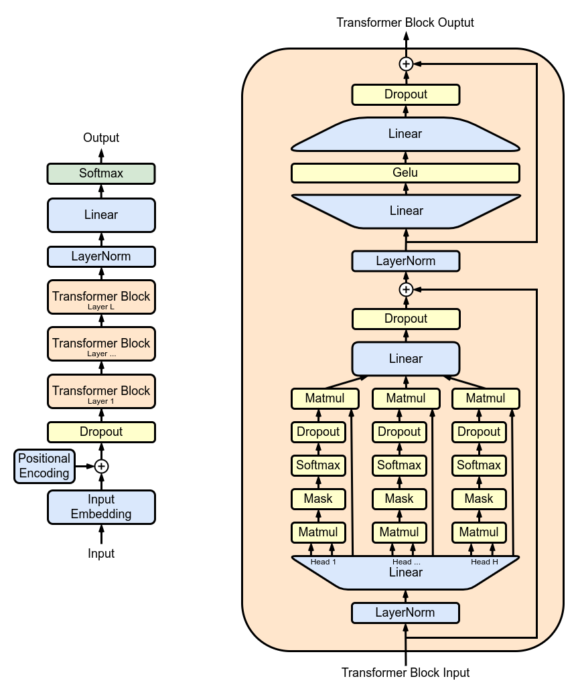
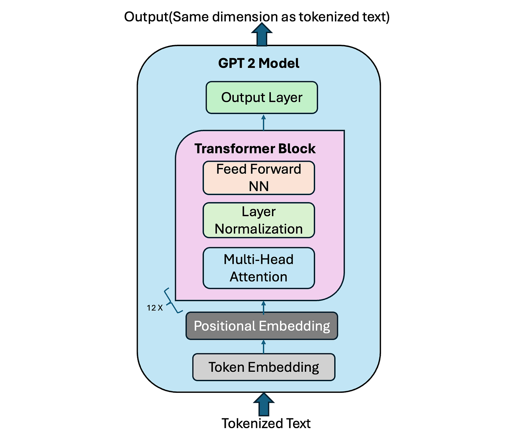
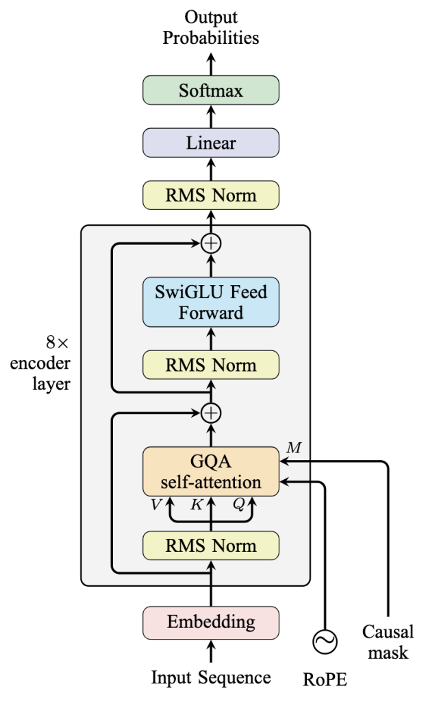
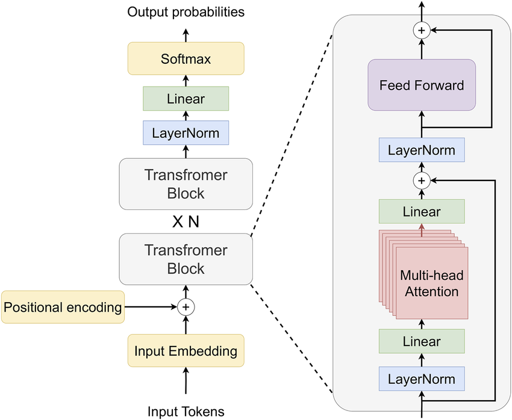
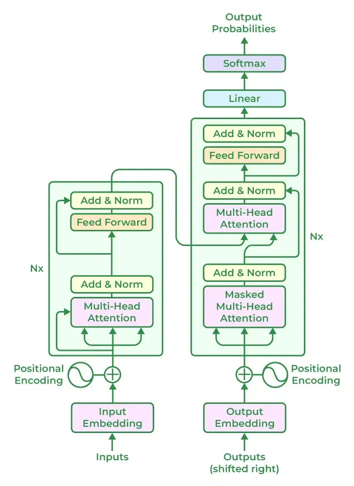

# Day_087 | 🏗️ Decoder-Only Transformer

The **Decoder-Only Transformer** architecture is the foundation for most modern Large Language Models (LLMs), such as **GPT** (Generative Pre-trained Transformer) and **Llama**. Its core function is **text generation**, making it an auto-regressive model.

It uses only the stack of **Decoder layers** from the original Transformer architecture, but it **removes the Cross-Attention mechanism** since there is no Encoder output to attend to.

---

## 🏗️ Core Architecture and Mechanism

### 1. Stacked Decoder Layers
The model is built from a stack of identical **Decoder blocks**. Unlike the full Encoder-Decoder model, the decoder-only version is simpler as it lacks the encoder and the cross-attention layer.

### 2. Auto-Regressive Generation
* **Definition:** The model is *auto-regressive*, meaning it generates the output sequence one token at a time, where each new token is conditioned on all the tokens that have been generated *before* it.
* **Training Objective:** During training, the model is taught to predict the **next token** in a sequence given the preceding tokens. This is often called **Causal Language Modeling**.

### 3. Masked Self-Attention (Causal Masking)
This is the most critical component that enables auto-regressive generation.

* **Mechanism:** In the Self-Attention layer, a **mask** is applied to the attention scores. This mask effectively sets the attention weight for all **future tokens** to negative infinity before the softmax operation.
* **Effect:** After the softmax, the future tokens receive an attention weight of zero. This **prevents a token from looking ahead** in the sequence. For example, when the model is calculating the representation for the word "cat," it can only use information from tokens that came *before* "cat" (e.g., "The furry"), ensuring the prediction of the next token is based only on past context. 
* **Why it's necessary:** This enforces **causality**, mimicking the way humans read and generate text, ensuring the model doesn't "cheat" by seeing the answer (the future tokens) during training.

---

## 🎯 Primary Focus and Applications

The Decoder-Only architecture is optimized for **Natural Language Generation (NLG)** tasks.

| Task Category | Application | Description |
| :--- | :--- | :--- |
| **Generative** | Open-ended text generation, creative writing, poetry. | Given a prompt, the model continues the text in a coherent, human-like manner. |
| **Conversational AI** | Chatbots and dialogue systems. | Generating a response based on the previous turn(s) of the conversation. |
| **Code Completion** | Generating the next line or block of code based on the existing code context. | Ideal for predicting the subsequent token in a constrained vocabulary. |
| **Instruction Following** | Answering questions, summarizing documents, rewriting text, or following complex prompts. | Modern LLMs are trained to treat these tasks as a form of sequential text generation. |

---

## 💡 Key Models

The decoder-only design is the dominant architecture for the most capable LLMs:

* **GPT** (Generative Pre-trained Transformer) series (e.g., GPT-3, GPT-4)
* **Llama** series (Llama 2, Llama 3)
* **Gemma**
* **Claude** models
* **Falcon**

---

## **1. Introduction**

The transformer architecture, introduced by Vaswani et al. (2017) in *“Attention is All You Need”*, revolutionized sequence modeling by replacing recurrent and convolutional networks with self-attention mechanisms. While the original transformer consists of an **encoder** and a **decoder**, the **decoder-only transformer** focuses exclusively on the decoder stack. This architecture is particularly effective for **autoregressive language modeling**, where the model predicts the next token in a sequence based on previous tokens.

---

## **2. Key Characteristics**

### **2.1 Autoregressive Nature**

* Decoder-only transformers generate sequences one token at a time.
* At step (t), the model only attends to tokens (\le t) to ensure causality.
* This is achieved through **causal masking** in the self-attention layers.

### **2.2 Architecture Overview**

A decoder-only transformer is composed of:

1. **Input Embedding Layer** – Converts discrete tokens into continuous vectors.
2. **Positional Encoding** – Adds sequential information to embeddings.
3. **Stack of Decoder Blocks** – Each block includes:

   * **Masked Multi-Head Self-Attention**
   * **Feed-Forward Network (MLP)**
   * **Residual Connections**
   * **Layer Normalization**
4. **Output Layer** – Typically a linear layer projecting to vocabulary size followed by softmax for token probabilities.

---

## **3. Mathematical Formulation**

For a given sequence of tokens $(x = (x_1, x_2, ..., x_n))$:

1. **Token Embedding**

$$
E = \text{Embedding}(x)
$$

2. **Positional Encoding**

$$
Z_0 = E + PE
$$

3. **Decoder Block (l)**

* **Masked Multi-Head Self-Attention**:

$$
\text{Attention}(Q,K,V) = \text{Softmax}\left(\frac{QK^\top}{\sqrt{d_k}} + M\right)V
$$

  Where (M) is the **causal mask** preventing attention to future tokens.

* **Feed-Forward Layer**:

$$
\text{FFN}(x) = \text{ReLU}(xW_1 + b_1) W_2 + b_2
$$

* **Residual Connections & LayerNorm**:

$$
x_{l} = \text{LayerNorm}(x_{l-1} + \text{Attention}(x_{l-1}))
$$

$$
x_{l} = \text{LayerNorm}(x_{l} + \text{FFN}(x_{l}))
$$

1. **Output Projection**

$$
\hat{y} = \text{Softmax}(x_L W_o + b_o)
$$

---

## **4. Causal Masking**

* Ensures the model cannot “peek” at future tokens.
* Implemented using an upper-triangular mask matrix (M):

$$
M_{ij} =
\begin{cases}
0 & i \ge j \
-\infty & i < j
\end{cases}
$$

* This guarantees autoregressive generation.

---

## **5. Advantages of Decoder-Only Transformers**

1. **Simplicity** – Only one stack of layers compared to encoder-decoder models.
2. **Efficient Autoregressive Generation** – Ideal for text generation tasks like chatbots, story generation, and code completion.
3. **Scalability** – Models like GPT series scale to billions of parameters without the need for separate encoder representations.

---

## **6. Limitations**

1. **Inefficient for bidirectional tasks** – Cannot fully leverage future context.
2. **Sequence Generation Speed** – Autoregressive decoding is sequential, limiting inference speed.
3. **Memory Footprint** – Large context lengths require quadratic memory in attention.

---

## **7. Applications**

* **Large Language Models (LLMs)**: GPT, GPT-2, GPT-3, ChatGPT, etc.
* **Code Generation**: Codex, AlphaCode.
* **Autoregressive Time Series Prediction**: Forecasting and sequence modeling.
* **Creative Text Generation**: Stories, poems, dialogue systems.

---

## **8. Implementation Notes**

* Typically implemented with frameworks like **PyTorch** or **TensorFlow**.
* Uses **multi-head attention**, where multiple attention heads allow the model to capture different patterns in parallel.
* **LayerNorm before residual** or **after residual** varies between implementations (pre-norm vs post-norm).

---

## **9. Differences with Encoder-Decoder Transformers**

| Feature        | Decoder-Only              | Encoder-Decoder                                        |
| -------------- | ------------------------- | ------------------------------------------------------ |
| Structure      | Single stack of decoders  | Encoder stack + decoder stack                          |
| Attention      | Masked self-attention     | Encoder-decoder attention + self-attention             |
| Use Case       | Autoregressive generation | Translation, summarization, sequence-to-sequence tasks |
| Context Access | Past tokens only          | Past + source sequence                                 |

---

## **10. Conclusion**

The decoder-only transformer is a highly versatile architecture designed for **autoregressive tasks**, offering simplicity and scalability while maintaining state-of-the-art performance in language modeling. It underpins modern LLMs and continues to be a foundation for generative AI models.

---

## Images

